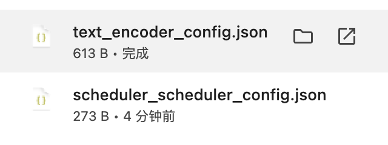

本文档分享一个手动下载预训练模型权重以及配置时可能会遇到的小问题。

一般我们在脚本的传参 `pretrained_model_name_or_path` 输入 huggingface 社区上的模型的 model name，就可以自动从社区上下载。比如 [black-forest-labs/FLUX.1-dev](https://huggingface.co/black-forest-labs/FLUX.1-dev/tree/main):

```python
from mindone.diffusers import DiffusionPipeline
pipe = DiffusionPipeline.from_pretrained("black-forest-labs/FLUX.1-dev")
```

有时候可能会遇到网络问题一时半会儿解决不了，我们需要按照格式逐个文件下载（包括配置、权重），然后按照和 hf 上一样的顺序放置全部文件。

但是逐个文件点击下载时，json 配置文件下载到本地后，文件命名会带上文件夹的名字，比如：




所有文件手动下载完成后，按照文件夹以及对应顺序存放配置文件和权重文件时，记得把 json 配置文件多出来的前缀删掉，对着 [black-forest-labs/FLUX.1-dev](https://huggingface.co/black-forest-labs/FLUX.1-dev/tree/main) 检查一次，否则传本地路径给 `pretrained_model_name_or_path` 时，模型的加载会报错找不到对应文件。