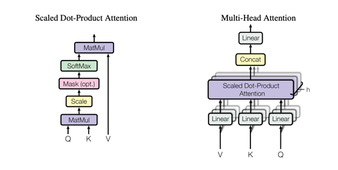

# T5 注意力模块的 MindSpore 实现

本文介绍如何基于 Mindspore 在 Ascend 910* 上实现 T5 网络的注意力模块。

> 以下仅通过示例代码对 T5 注意力模块进行简单讲解，完整代码请到 mindone 套件中获取，代码位置 [opensora-pku](https://github.com/mindspore-lab/mindone/tree/master/examples/opensora_pku/opensora/models/text_encoder/t5_encoder.py)

## 1. 注意力模块原理介绍

self-attention 计算公式：

$$
Attention(Q, K, V) = softmax(\frac{QK^T}{\sqrt d})V
$$

attention 模块原理图，参考自 [illustrated-transformer](https://jalammar.github.io/illustrated-transformer/) 与 [transformer](https://arxiv.org/abs/1706.03762):



## 2. MindSpore 实现

### 2.1 Query, Key, and Value matrices 计算


```python
from mindspore import nn, Tensor
import numpy as np

x, sequence_len, input_dim, inner_dim = Tensor(np.random.randn(2, 256, 1024)), 256, 1024, 1024

to_q = nn.Dense(input_dim, inner_dim, has_bias=False)
to_k = nn.Dense(input_dim, inner_dim, has_bias=False)
to_v = nn.Dense(input_dim, inner_dim, has_bias=False)

q, k, v = to_q(x), to_k(x), to_v(x)
```

### 2.2 Attention 计算


```python
from mindspore import ops

q, k, v = ...
scale_sqrt_d = k.shape[-1] ** -0.5

out = ops.matmul(ops.softmax(ops.matmul(q, k.transpose(1, 0)) * scale_sqrt_d), v)
```

### 2.3 T5 Attention 位置嵌入计算

T5 使用 简化位置嵌入 替换原始transformer使用的 正弦嵌入信号(sinusoidal position signal) 或 已学习的嵌入(learned position embeddings)。


```python
import numpy as np
import mindspore as ms
from mindspore import nn, ops

hidden_states, relative_attention_num_buckets, relative_attention_max_distance, n_heads, key_length = ...
sequence_len = hidden_states.shape[1]

relative_attention_bias = nn.Embedding(relative_attention_num_buckets, n_heads)

def compute_bias(query_length, key_length):
    """Compute binned relative position bias"""
    def arange(start=0, end=None, step=1, *, dtype=None):
        """inner arange"""
        res = ms.Tensor(np.arange(start, end, step))
        if dtype is not None:
            res = res.astype(dtype)
        return res
    
    def _relative_position_bucket(relative_position, bidirectional=True, num_buckets=32, max_distance=128):
        relative_buckets = 0
        if bidirectional:
            num_buckets //= 2
            relative_buckets += (relative_position > 0).astype(ms.int64) * num_buckets
            relative_position = ops.abs(relative_position)
        else:
            relative_position = 0 - ops.minimum(relative_position, ops.zeros(relative_position.shape)).astype(ms.int64)
        # now relative_position is in the range [0, inf)
        # half of the buckets are for exact increments in positions
        max_exact = num_buckets // 2
        is_small = relative_position < max_exact
        # The other half of the buckets are for logarithmically bigger bins in positions up to max_distance
        relative_position_if_large = (
            max_exact
            + ops.log(relative_position.astype(ms.float32) / max_exact)
            / ms.numpy.log(max_distance / max_exact)
            * (num_buckets - max_exact)
        ).astype(ms.int64)
        relative_position_if_large = ops.minimum(
            relative_position_if_large,
            ops.fill(ms.int64, relative_position_if_large.shape, num_buckets - 1),
        )
        # relative_buckets += ops.where(is_small, relative_position\
        # , relative_position_if_large) # mindspore 2.0
        relative_buckets += ops.select(
            is_small.astype(ms.bool_), relative_position, relative_position_if_large
        )  # mindspore 1.10
        return relative_buckets
    
    context_position = arange(query_length, dtype=ms.int64)[:, None]
    memory_position = arange(key_length, dtype=ms.int64)[None, :]
    relative_position = memory_position - context_position  # shape (query_length, key_length)
    relative_position_bucket = _relative_position_bucket(
        relative_position,  # shape (query_length, key_length)
        bidirectional=True,
        num_buckets=relative_attention_num_buckets,
        max_distance=relative_attention_max_distance,
    )
    values = relative_attention_bias(relative_position_bucket)  # shape (query_length, key_length, num_heads)
    values = values.transpose([2, 0, 1]).expand_dims(0)  # shape (1, num_heads, query_length, key_length)
    return values

position_bias = compute_bias(sequence_len, key_length)
```


### 2.4 T5 Self-Attention 自注意力模块代码

self-attention 结构图，参考自 [@Sebastian Raschka](https://sebastianraschka.com/blog/2023/self-attention-from-scratch.html)


```python
from mindspore import nn
from ... import T5Attention, T5LayerNorm

class T5LayerSelfAttention(nn.Cell):
    """T5LayerSelfAttention"""

    def __init__(self, config, has_relative_attention_bias=False):
        super().__init__()
        self.SelfAttention = T5Attention(config, has_relative_attention_bias=has_relative_attention_bias)
        self.layer_norm = T5LayerNorm(config.d_model, eps=config.layer_norm_epsilon)
        self.dropout = nn.Dropout(p=config.dropout_rate)
        self.use_cache = config.use_cache

    def construct(
        self,
        hidden_states,
        attention_mask=None,
        position_bias=None,
        layer_head_mask=None,
        past_key_value=None,
    ):
        normed_hidden_states = self.layer_norm(hidden_states)
        attention_output = self.SelfAttention(
            normed_hidden_states,
            mask=attention_mask,
            position_bias=position_bias,
            layer_head_mask=layer_head_mask,
            past_key_value=past_key_value,
        )
        hidden_states = hidden_states + self.dropout(attention_output[0])
        outputs = (hidden_states,) + attention_output[1:]  # add attentions if we output them
        return outputs
```


### 2.5 T5 Cross-Attention 交叉注意力模块代码

cross-attention 结构图，参考自 [@Sebastian Raschka](https://sebastianraschka.com/blog/2023/self-attention-from-scratch.html)


```python
from mindspore import nn
from ... import T5Attention, T5LayerNorm

class T5LayerCrossAttention(nn.Cell):
    """T5LayerCrossAttention"""

    def __init__(self, config):
        super().__init__()
        self.EncDecAttention = T5Attention(config, has_relative_attention_bias=False)
        self.layer_norm = T5LayerNorm(config.d_model, eps=config.layer_norm_epsilon)
        self.dropout = nn.Dropout(p=config.dropout_rate)
        self.use_cache = config.use_cache

    def construct(
        self,
        hidden_states,
        key_value_states,
        attention_mask=None,
        position_bias=None,
        layer_head_mask=None,
        past_key_value=None,
        query_length=None,
    ):
        normed_hidden_states = self.layer_norm(hidden_states)
        attention_output = self.EncDecAttention(
            normed_hidden_states,
            mask=attention_mask,
            key_value_states=key_value_states,
            position_bias=position_bias,
            layer_head_mask=layer_head_mask,
            past_key_value=past_key_value,
            query_length=query_length,
        )
        layer_output = hidden_states + self.dropout(attention_output[0])
        outputs = (layer_output,) + attention_output[1:]  # add attentions if we output them
        return outputs
```


### 2.6 T5 Attention 基础模块完整代码

```python
from transformers.models.t5.configuration_t5 import T5Config
from mindspore import  ops, nn
import mindspore as ms
import numpy as np

class T5Attention(nn.Cell):
    """T5Attention"""

    def __init__(self, config: T5Config, has_relative_attention_bias=False):
        super().__init__()
        self.is_decoder = config.is_decoder
        self.use_cache = config.use_cache
        self.output_attentions = False
        self.has_relative_attention_bias = has_relative_attention_bias
        self.relative_attention_num_buckets = config.relative_attention_num_buckets
        self.relative_attention_max_distance = config.relative_attention_max_distance
        self.d_model = config.d_model
        self.key_value_proj_dim = config.d_kv
        self.n_heads = config.num_heads
        self.dropout = config.dropout_rate
        self.inner_dim = self.n_heads * self.key_value_proj_dim

        # Mesh TensorFlow initialization to avoid scaling before softmax
        self.q = nn.Dense(self.d_model, self.inner_dim, has_bias=False)
        self.k = nn.Dense(self.d_model, self.inner_dim, has_bias=False)
        self.v = nn.Dense(self.d_model, self.inner_dim, has_bias=False)
        self.o = nn.Dense(self.inner_dim, self.d_model, has_bias=False)

        if self.has_relative_attention_bias:
            self.relative_attention_bias = nn.Embedding(self.relative_attention_num_buckets, self.n_heads)
        # self.pruned_heads = set()
        self.gradient_checkpointing = False

    @staticmethod
    def _relative_position_bucket(relative_position, bidirectional=True, num_buckets=32, max_distance=128):
        relative_buckets = 0
        if bidirectional:
            num_buckets //= 2
            relative_buckets += (relative_position > 0).astype(ms.int64) * num_buckets
            relative_position = ops.abs(relative_position)
        else:
            relative_position = 0 - ops.minimum(relative_position, ops.zeros(relative_position.shape)).astype(ms.int64)
        # now relative_position is in the range [0, inf)
        # half of the buckets are for exact increments in positions
        max_exact = num_buckets // 2
        is_small = relative_position < max_exact
        # The other half of the buckets are for logarithmically bigger bins in positions up to max_distance
        relative_position_if_large = (
            max_exact
            + ops.log(relative_position.astype(ms.float32) / max_exact)
            / ms.numpy.log(max_distance / max_exact)
            * (num_buckets - max_exact)
        ).astype(ms.int64)
        relative_position_if_large = ops.minimum(
            relative_position_if_large,
            ops.fill(ms.int64, relative_position_if_large.shape, num_buckets - 1),
        )
        # relative_buckets += ops.where(is_small, relative_position\
        # , relative_position_if_large) # mindspore 2.0
        relative_buckets += ops.select(
            is_small.astype(ms.bool_), relative_position, relative_position_if_large
        )  # mindspore 1.10
        return relative_buckets

    def compute_bias(self, query_length, key_length):
        """Compute binned relative position bias"""
        context_position = arange(query_length, dtype=ms.int64)[:, None]
        memory_position = arange(key_length, dtype=ms.int64)[None, :]
        relative_position = memory_position - context_position  # shape (query_length, key_length)
        relative_position_bucket = self._relative_position_bucket(
            relative_position,  # shape (query_length, key_length)
            bidirectional=(not self.is_decoder),
            num_buckets=self.relative_attention_num_buckets,
            max_distance=self.relative_attention_max_distance,
        )
        values = self.relative_attention_bias(relative_position_bucket)  # shape (query_length, key_length, num_heads)
        values = values.transpose([2, 0, 1]).expand_dims(0)  # shape (1, num_heads, query_length, key_length)
        return values

    def construct(
        self,
        hidden_states,
        mask=None,
        key_value_states=None,
        position_bias=None,
        past_key_value=None,
        layer_head_mask=None,
        query_length=None,
        use_cache=False,
        output_attentions=False,
    ):
        """
        Self-attention (if key_value_states is None) or attention over source sentence (provided by key_value_states).
        """
        # Input is (batch_size, seq_length, dim)
        # Mask is (batch_size, key_length) (non-causal) or (batch_size, key_length, key_length)
        # past_key_value[0] is (batch_size, n_heads, q_len - 1, dim_per_head)
        batch_size, seq_length = hidden_states.shape[:2]

        real_seq_length = seq_length

        if past_key_value is not None:
            assert (
                len(past_key_value) == 2
            ), f"past_key_value should have 2 past states: keys and values. Got { len(past_key_value)} past states"
            real_seq_length += past_key_value[0].shape[2] if query_length is None else query_length

        key_length = real_seq_length if key_value_states is None else key_value_states.shape[1]

        def shape(states):
            """projection"""
            return states.view(batch_size, -1, self.n_heads, self.key_value_proj_dim).swapaxes(1, 2)

        def unshape(states):
            """reshape"""
            return states.swapaxes(1, 2).view(batch_size, -1, self.inner_dim)

        def project(hidden_states, proj_layer, key_value_states, past_key_value):
            """projects hidden states correctly to key/query states"""
            if key_value_states is None:
                # self-attn
                # (batch_size, n_heads, seq_length, dim_per_head)
                hidden_states = shape(proj_layer(hidden_states))
            elif past_key_value is None:
                # cross-attn
                # (batch_size, n_heads, seq_length, dim_per_head)
                hidden_states = shape(proj_layer(key_value_states))

            if past_key_value is not None:
                if key_value_states is None:
                    # self-attn
                    # (batch_size, n_heads, key_length, dim_per_head)
                    hidden_states = ops.cat([past_key_value, hidden_states], axis=2)
                elif past_key_value.shape[2] != key_value_states.shape[1]:
                    # checking that the `sequence_length` of the `past_key_value` is the same as
                    # the provided `key_value_states` to support prefix tuning
                    # cross-attn
                    # (batch_size, n_heads, seq_length, dim_per_head)
                    hidden_states = shape(proj_layer(key_value_states))
                else:
                    # cross-attn
                    hidden_states = past_key_value
            return hidden_states

        # get query states
        query_states = shape(self.q(hidden_states))  # (batch_size, n_heads, seq_length, dim_per_head)

        # get key/value states
        key_states = project(
            hidden_states, self.k, key_value_states, past_key_value[0] if past_key_value is not None else None
        )
        value_states = project(
            hidden_states, self.v, key_value_states, past_key_value[1] if past_key_value is not None else None
        )

        # compute scores
        scores = ops.matmul(
            query_states, key_states.swapaxes(3, 2)
        )  # equivalent of torch.einsum("bnqd,bnkd->bnqk", query_states, key_states), compatible with onnx op>9

        if position_bias is None:
            if not self.has_relative_attention_bias:
                position_bias = ops.zeros((1, self.n_heads, real_seq_length, key_length), scores.dtype)
            else:
                position_bias = self.compute_bias(real_seq_length, key_length)

            # if key and values are already calculated
            # we want only the last query position bias
            if past_key_value is not None:
                position_bias = position_bias[:, :, -hidden_states.size(1) :, :]

            if mask is not None:
                position_bias = position_bias + mask  # (batch_size, n_heads, seq_length, key_length)

        position_bias_masked = position_bias

        scores += position_bias_masked
        attn_weights = ops.softmax(scores.astype(ms.float32), axis=-1).astype(
            scores.dtype
        )  # (batch_size, n_heads, seq_length, key_length)
        if self.training:
            attn_weights = ops.dropout(attn_weights, p=self.dropout)  # (batch_size, n_heads, seq_length, key_length)

        # Mask heads if we want to
        if layer_head_mask is not None:
            attn_weights = attn_weights * layer_head_mask

        attn_output = unshape(ops.matmul(attn_weights, value_states))  # (batch_size, seq_length, dim)
        attn_output = self.o(attn_output)

        present_key_value_state = (key_states, value_states) if (self.is_decoder and self.use_cache) else None
        outputs = (attn_output,) + (present_key_value_state,) + (position_bias,)
        return outputs

def arange(start=0, end=None, step=1, *, dtype=None):
    """inner arange"""
    res = ms.Tensor(np.arange(start, end, step))
    if dtype is not None:
        res = res.astype(dtype)
    return res
```
