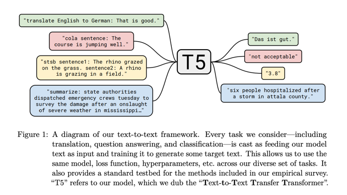
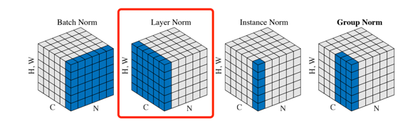
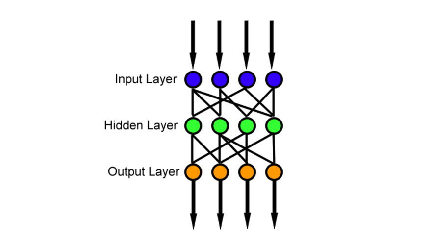
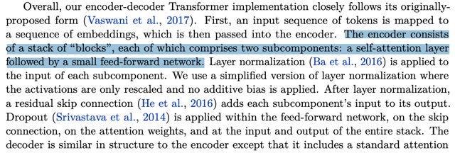
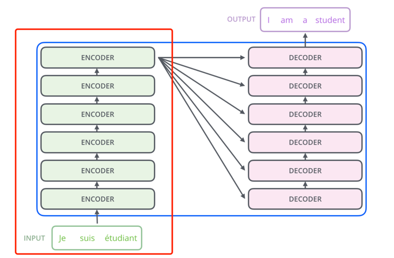

# T5 简介与 MindSpore 实现

本文介绍如何使用 Mindspore 在 Ascend 910* 上构建 OpenSora-PKU 中用到的 T5 (Text-to-Text Transfer Transformer) 文本编码器模型。

> 以下仅通过示例代码对 OpenSora-PKU 中 T5 文本编码器模型进行简单讲解，完整代码请到 mindone 套件中获取，代码位置 [opensora-pku](https://github.com/mindspore-lab/mindone/blob/b3d2a7c5faea702b6a440f488ead0697e84bf502/examples/opensora_pku/opensora/models/text_encoder/t5_encoder.py)

论文：[Exploring the Limits of Transfer Learning with a Unified Text-to-Text Transformer](https://arxiv.org/abs/1910.10683)

原官方实现：https://github.com/google-research/text-to-text-transfer-transformer



## 1. T5 结构简介

T5 模型是基于 encoder-decoder 的 Transformer 结构，并且其实现较原 [Transformer](https://arxiv.org/abs/1706.03762) 相近，先是将 `token 序列` 映射到 `embedding 序列` 所在的嵌入空间，然后传入 Encoder 编码器，最后传入 Decoder 解码器得到结果。 OpenSora-PKU 中使用了 T5 Encoder 作为文本编码器，后面章节重点介绍编码器部分结构。

### 1.1 基本 Transformer 及其 Encoder 结构介绍

transformer 结构图，参考自 [illustrated-transformer](https://jalammar.github.io/illustrated-transformer/)：


encoder 结构图，参考自 [illustrated-transformer](https://jalammar.github.io/illustrated-transformer/)：


### 1.2 T5 结构较原Transformer改动点

- 简化的 `层归一化层 (LayerNorm)`，将在下面介绍
- 简化的 `位置嵌入(Position Embedding)`，详情见 [注意力模块中2.3节的描述](./attention_module_implement.md)


## 2. MindSpore 实现

### 2.1 T5 Attention 注意力模块实现

请参考，[T5 注意力模块的 MindSpore 实现](./attention_module_implement.md)

### 2.2 T5 LayerNorm 基础模块实现

T5 LayerNorm 模块中仅对激活层进行重新缩放并去掉了额外的偏置(bias)操作。

T5 layernorm 细节描述，参考自 [原T5论文](https://arxiv.org/pdf/1910.10683)


layernorm 结构图，参考自 [GN论文插图](https://arxiv.org/pdf/1803.08494)



```python
import mindspore as ms
from mindspore import nn, ops

class T5LayerNorm(nn.Cell):
    """T5LayerNorm"""

    def __init__(self, hidden_size, eps=1e-6):
        """
        Construct a layernorm module in the T5 style. No bias and no subtraction of mean.
        """
        super().__init__()
        self.weight = ms.Parameter(ops.ones(hidden_size, ms.float32))
        self.variance_epsilon = eps

    def construct(self, hidden_states):
        variance = hidden_states.astype(ms.float32).pow(2).mean(-1, keep_dims=True)
        hidden_states = hidden_states / ops.sqrt(variance + self.variance_epsilon)
        # convert into half-precision if necessary
        if self.weight.dtype in [ms.float16]:
            hidden_states = hidden_states.astype(self.weight.dtype)

        return self.weight * hidden_states
```

### 2.3 Feed-Forward 模块实现

feed-forward 结构图，参考自 [@Kye Gomez](https://medium.com/@kyeg/the-feedforward-demystified-a-core-operation-of-transformers-afcd3a136c4c)



```python
import mindspore as ms
from mindspore import nn, ops
from transformers.models.t5.configuration_t5 import T5Config
from ... import T5LayerNorm

class T5LayerFF(nn.Cell):
    """T5LayerFF"""

    def __init__(self, config: T5Config):
        super().__init__()
        if config.is_gated_act:
            self.DenseReluDense = T5DenseGatedActDense(config)
        else:
            self.DenseReluDense = T5DenseActDense(config)

        self.layer_norm = T5LayerNorm(config.d_model, eps=config.layer_norm_epsilon)
        self.dropout = nn.Dropout(p=config.dropout_rate)

    def construct(self, hidden_states):
        forwarded_states = self.layer_norm(hidden_states)
        forwarded_states = self.DenseReluDense(forwarded_states)
        hidden_states = hidden_states + self.dropout(forwarded_states)
        return hidden_states

    
class T5DenseGatedActDense(nn.Cell):
    """T5DenseGatedActDense"""

    def __init__(self, config: T5Config):
        super().__init__()
        self.wi_0 = nn.Dense(config.d_model, config.d_ff, has_bias=False)
        self.wi_1 = nn.Dense(config.d_model, config.d_ff, has_bias=False)
        self.wo = nn.Dense(config.d_ff, config.d_model, has_bias=False)
        self.dropout = nn.Dropout(p=config.dropout_rate)
        self.act = ops.gelu

    def construct(self, hidden_states):
        hidden_gelu = self.act(self.wi_0(hidden_states))
        hidden_linear = self.wi_1(hidden_states)
        hidden_states = hidden_gelu * hidden_linear
        hidden_states = self.dropout(hidden_states)

        if self.wo.weight.dtype not in (hidden_states.dtype, ms.int8):
            hidden_states = hidden_states.astype(self.wo.weight.dtype)

        hidden_states = self.wo(hidden_states)
        return hidden_states

    
class T5DenseActDense(nn.Cell):
    """T5DenseActDense"""

    def __init__(self, config: T5Config):
        super().__init__()
        self.wi = nn.Dense(config.d_model, config.d_ff, has_bias=False)
        self.wo = nn.Dense(config.d_ff, config.d_model, has_bias=False)
        self.dropout = nn.Dropout(p=config.dropout_rate)
        self.act = ops.gelu

    def construct(self, hidden_states):
        hidden_states = self.wi(hidden_states)
        hidden_states = self.act(hidden_states)
        hidden_states = self.dropout(hidden_states)
        if self.wo.weight.dtype not in (hidden_states.dtype, ms.int8):
            hidden_states = hidden_states.astype(self.wo.weight.dtype)
        hidden_states = self.wo(hidden_states)
        return hidden_states
```

### 2.4 T5 Block 实现

encoder block 结构图，参考自 [illustrated-transformer](https://jalammar.github.io/illustrated-transformer/)：


```python
import mindspore as ms
import numpy as np
from mindspore import nn, ops

from ... import T5LayerSelfAttention, T5LayerCrossAttention, T5LayerFF

class T5Block(nn.Cell):
    """T5Block"""

    def __init__(self, config, has_relative_attention_bias=False):
        super().__init__()
        self.is_decoder = config.is_decoder
        self.layer = nn.CellList()
        self.layer.append(T5LayerSelfAttention(config, has_relative_attention_bias=has_relative_attention_bias))
        if self.is_decoder:
            self.layer.append(T5LayerCrossAttention(config))

        self.layer.append(T5LayerFF(config))

    def construct(
        self,
        hidden_states,
        attention_mask=None,
        position_bias=None,
        encoder_hidden_states=None,
        encoder_attention_mask=None,
        encoder_decoder_position_bias=None,
        layer_head_mask=None,
        cross_attn_layer_head_mask=None,
        past_key_value=None,
    ):
        cross_attn_past_key_value = None

        self_attention_outputs = self.layer[0](
            hidden_states,
            attention_mask=attention_mask,
            position_bias=position_bias,
            layer_head_mask=layer_head_mask,
            past_key_value=None,
        )
        hidden_states, present_key_value_state = self_attention_outputs[:2]
        attention_outputs = self_attention_outputs[2:]  # Keep self-attention outputs and relative position weights

        # clamp inf values to enable fp16 training
        if hidden_states.dtype == ms.float16 and ops.isinf(hidden_states).any():
            clamp_value = np.finfo(np.float16).max - 1000.0
            hidden_states = ops.clamp(hidden_states, min=-clamp_value, max=clamp_value)

        do_cross_attention = self.is_decoder and encoder_hidden_states is not None
        if do_cross_attention:
            cross_attention_outputs = self.layer[1](
                hidden_states,
                key_value_states=encoder_hidden_states,
                attention_mask=encoder_attention_mask,
                position_bias=encoder_decoder_position_bias,
                layer_head_mask=cross_attn_layer_head_mask,
                past_key_value=cross_attn_past_key_value,
                query_length=None,
            )
            hidden_states = cross_attention_outputs[0]

            # clamp inf values to enable fp16 training
            if hidden_states.dtype == ms.float16 and ops.isinf(hidden_states).any():
                clamp_value = np.finfo(np.float16).max - 1000.0
                hidden_states = ops.clamp(hidden_states, min=-clamp_value, max=clamp_value)

            # Combine self attn and cross attn key value states
            if present_key_value_state is not None:
                present_key_value_state = present_key_value_state + cross_attention_outputs[1]

            # Keep cross-attention outputs and relative position weights
            attention_outputs = attention_outputs + cross_attention_outputs[2:]

        # Apply Feed Forward layer
        hidden_states = self.layer[-1](hidden_states)

        # clamp inf values to enable fp16 training
        if hidden_states.dtype == ms.float16 and ops.isinf(hidden_states).any():
            clamp_value = np.finfo(np.float16).max - 1000.0
            hidden_states = ops.clamp(hidden_states, min=-clamp_value, max=clamp_value)

        outputs = (hidden_states,)

        if self.use_cache:
            outputs = outputs + (present_key_value_state,) + attention_outputs
        else:
            outputs = outputs + attention_outputs

        return outputs

```

### 2.5 T5 Encoder 实现

encoder 结构描述，参考自 [T5原论文](https://arxiv.org/pdf/1910.10683)：



encoder stack 结构图，参考自 [illustrated-transformer](https://jalammar.github.io/illustrated-transformer/)：



```python
import copy
import mindspore as ms
import numpy as np
from mindspore import nn, ops
from transformers import AutoTokenizer
from transformers.models.t5.configuration_t5 import T5Config
from mindone.transformers.modeling_utils import MSPreTrainedModel as PreTrainedModel

from ... import T5LayerSelfAttention, T5LayerCrossAttention, T5LayerFF, T5LayerNorm

    
class T5PreTrainedModel(PreTrainedModel):
    """
    An abstract class to handle weights initialization and a simple interface for downloading and loading pretrained
    models.
    """

    config_class = T5Config
    base_model_prefix = "transformer"
    # pretrained_model_archive_map = PRETRAINED_MODEL_ARCHIVE_MAP
    is_parallelizable = True
    supports_gradient_checkpointing = True
    _no_split_modules = ["T5Block"]
    _keep_in_fp32_modules = ["wo"]

    def _shift_right(self, input_ids):
        decoder_start_token_id = self.config.decoder_start_token_id
        pad_token_id = self.config.pad_token_id

        assert decoder_start_token_id is not None, (
            "self.model.config.decoder_start_token_id has to be defined. In T5 it is usually set to the pad_token_id."
            " See T5 docs for more information"
        )

        # shift inputs to the right
        shifted_input_ids = ops.zeros(input_ids.shape, input_ids.dtype)
        shifted_input_ids[..., 1:] = input_ids[..., :-1].copy()
        shifted_input_ids[..., 0] = decoder_start_token_id

        assert pad_token_id is not None, "self.model.config.pad_token_id has to be defined."
        # replace possible -100 values in labels by `pad_token_id`
        shifted_input_ids = ops.masked_fill(shifted_input_ids, shifted_input_ids == -100, pad_token_id)
        return shifted_input_ids
    
    
class T5Stack(T5PreTrainedModel):
    """T5Stack"""

    def __init__(self, config, embed_tokens=None):
        super().__init__(config)

        self.embed_tokens = embed_tokens
        self.is_decoder = config.is_decoder
        self.num_layers = config.num_layers

        self.block = nn.CellList(
            [T5Block(config, has_relative_attention_bias=bool(i == 0)) for i in range(self.num_layers)]
        )
        self.final_layer_norm = T5LayerNorm(config.d_model, eps=config.layer_norm_epsilon)
        self.dropout = nn.Dropout(p=config.dropout_rate)
        self.use_cache = config.use_cache

    def get_input_embeddings(self):
        return self.embed_tokens

    def set_input_embeddings(self, new_embeddings):
        self.embed_tokens = new_embeddings

    def construct(
        self,
        input_ids=None,
        attention_mask=None,
        encoder_hidden_states=None,
        encoder_attention_mask=None,
        inputs_embeds=None,
        head_mask=None,
        cross_attn_head_mask=None,
        past_key_values=None,
    ):
        if input_ids is not None and inputs_embeds is not None:
            err_msg_prefix = "decoder_" if self.is_decoder else ""
            raise ValueError(
                f"You cannot specify both {err_msg_prefix}input_ids and {err_msg_prefix}inputs_embeds at the same time"
            )
        if input_ids is not None:
            input_shape = input_ids.shape
            input_ids = input_ids.view(-1, input_shape[-1])
        elif inputs_embeds is not None:
            input_shape = inputs_embeds.shape[:-1]
        else:
            err_msg_prefix = "decoder_" if self.is_decoder else ""
            raise ValueError(f"You have to specify either {err_msg_prefix}input_ids or {err_msg_prefix}inputs_embeds")

        if inputs_embeds is None:
            assert self.embed_tokens is not None, "You have to initialize the model with valid token embeddings"
            inputs_embeds = self.embed_tokens(input_ids)

        batch_size, seq_length = input_shape

        # required mask seq length can be calculated via length of past
        mask_seq_length = past_key_values[0][0].shape[2] + seq_length if past_key_values is not None else seq_length

        if self.use_cache is True:
            assert self.is_decoder, f"`use_cache` can only be set to `True` if {self} is used as a decoder"

        if attention_mask is None:
            attention_mask = ops.ones((batch_size, mask_seq_length), ms.float32)
        if self.is_decoder and encoder_attention_mask is None and encoder_hidden_states is not None:
            encoder_seq_length = encoder_hidden_states.shape[1]
            encoder_attention_mask = ops.ones((batch_size, encoder_seq_length), ms.int64)

        # initialize past_key_values with `None` if past does not exist
        if past_key_values is None:
            past_key_values = [None] * len(self.block)

        # We can provide a self-attention mask of dimensions [batch_size, from_seq_length, to_seq_length]
        # ourselves in which case we just need to make it broadcastable to all heads.
        extended_attention_mask = self.get_extended_attention_mask(attention_mask, input_shape)

        # If a 2D or 3D attention mask is provided for the cross-attention
        # we need to make broadcastable to [batch_size, num_heads, seq_length, seq_length]
        if self.is_decoder and encoder_hidden_states is not None:
            encoder_batch_size, encoder_sequence_length, _ = encoder_hidden_states.shape
            encoder_hidden_shape = (encoder_batch_size, encoder_sequence_length)
            if encoder_attention_mask is None:
                encoder_attention_mask = ops.ones(encoder_hidden_shape)
            encoder_extended_attention_mask = self.invert_attention_mask(encoder_attention_mask)
        else:
            encoder_extended_attention_mask = None

        # Prepare head mask if needed
        head_mask = self.get_head_mask(head_mask, self.num_layers)
        cross_attn_head_mask = self.get_head_mask(cross_attn_head_mask, self.num_layers)
        present_key_value_states = []
        position_bias = None
        encoder_decoder_position_bias = None

        hidden_states = self.dropout(inputs_embeds)

        for i, (layer_module, past_key_value) in enumerate(zip(self.block, past_key_values)):
            layer_head_mask = head_mask[i]
            cross_attn_layer_head_mask = cross_attn_head_mask[i]

            layer_outputs = layer_module(
                hidden_states,
                attention_mask=extended_attention_mask,
                position_bias=position_bias,
                encoder_hidden_states=encoder_hidden_states,
                encoder_attention_mask=encoder_extended_attention_mask,
                encoder_decoder_position_bias=encoder_decoder_position_bias,
                layer_head_mask=layer_head_mask,
                cross_attn_layer_head_mask=cross_attn_layer_head_mask,
                past_key_value=past_key_value,
            )

            # layer_outputs is a tuple with:
            # hidden-states, key-value-states, (self-attention position bias), \
            # (self-attention weights), (cross-attention position bias), (cross-attention weights)
            if self.use_cache is False:
                layer_outputs = layer_outputs[:1] + (None,) + layer_outputs[1:]

            hidden_states, present_key_value_state = layer_outputs[:2]

            # We share the position biases between the layers - the first layer store them
            # layer_outputs = hidden-states, key-value-states (self-attention position bias), (self-attention weights),
            # (cross-attention position bias), (cross-attention weights)
            position_bias = layer_outputs[2]
            if self.is_decoder and encoder_hidden_states is not None:
                encoder_decoder_position_bias = layer_outputs[3]
            # append next layer key value states
            if self.use_cache:
                present_key_value_states.append(present_key_value_state)

        hidden_states = self.final_layer_norm(hidden_states)
        hidden_states = self.dropout(hidden_states)

        return tuple(
            v
            for v in [
                hidden_states,
                present_key_value_states,
            ]
            if v is not None and len(v) > 0
        )


class T5EncoderModel(T5PreTrainedModel):
    """T5EncoderModel"""

    _keys_to_ignore_on_load_missing = [r"encoder.embed_tokens.weight"]

    def __init__(self, config: T5Config):
        super().__init__(config)
        self.shared = nn.Embedding(config.vocab_size, config.d_model)

        encoder_config = copy.deepcopy(config)
        encoder_config.use_cache = False
        encoder_config.is_encoder_decoder = False
        self.encoder = T5Stack(encoder_config, self.shared)

    def get_input_embeddings(self):
        return self.shared

    def set_input_embeddings(self, new_embeddings):
        self.shared = new_embeddings
        self.encoder.set_input_embeddings(new_embeddings)

    def get_encoder(self):
        """get encoder"""
        return self.encoder

    def construct(
        self,
        input_ids=None,
        attention_mask=None,
        head_mask=None,
        inputs_embeds=None,
    ):
        encoder_outputs = self.encoder(
            input_ids=input_ids,
            attention_mask=attention_mask,
            inputs_embeds=inputs_embeds,
            head_mask=head_mask,
        )

        return encoder_outputs
```
