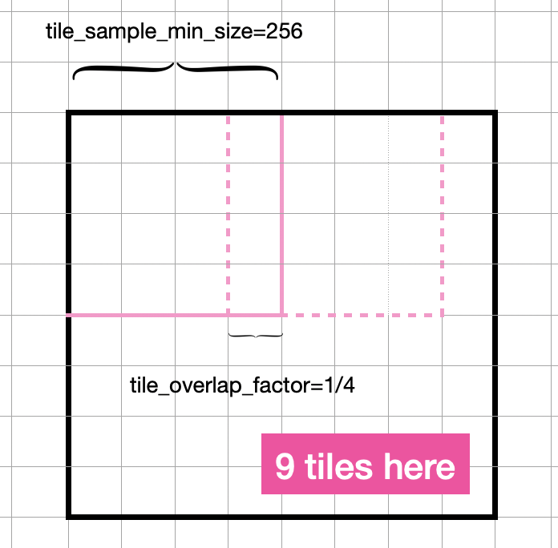

# VAE tiling 算法实现

VAE 在扩散模型中作为原始图像/视频与隐空间之前的编码器和解码器，编解码的过程随着图像/视频变大会消耗更多显存。Tailed VAE 算法通过分块编解码降低显存消耗，可以避免OOM问题，以及允许扩散模型在更大的图像/视频上运行。

本文介绍基于 Mindspore + Ascend 910* 的 3d-VAE tiling 算法实现，代码参考自 mindone 套件 [opensora-pku](https://github.com/mindspore-lab/mindone/tree/master/examples/opensora_pku/opensora/models/ae/videobase/causal_vae/modeling_causalvae.py) 的 `CausalVAEModel` `enable_tiling` 功能。


## 1. Implement

### 1.1 Original VAE (3d)

以下是正常的 3d-VAE 的结构（仅作示例使用，不可运行），扩散过程开始前调用 `CausalVAEModel.encode` 把原始视频 `x` 编码到 latent space 得到 `z`， 扩散过程完成后调用 `CausalVAEModel.decode` 把隐空间变量 `z` 解码成视频 `x`：


```python
import mindspore as ms
from mindspore import nn, ops, Tensor

# clone mindone repo, cd mindone
from examples.opensora_pku.opensora.models.ae.videobase.causal_vae.modeling_causalvae import Encoder, Decoder
from examples.opensora_pku.opensora.models.ae.videobase.modules.conv import CausalConv3d

class CausalVAEModel(nn.Cell):
    def __init__(
            self,
            hidden_size: int = 128,
            z_channels: int = 4,
            embed_dim: int = 4,
            ...
        
        ):
        super().__init__()
        self.encoder = Encoder(...)
        self.decoder = Decoder(...)
        self.quant_conv = CausalConv3d(2 * z_channels, 2 * embed_dim, 1)
        self.post_quant_conv = CausalConv3d(embed_dim, z_channels, 1)

        self.split = ops.Split(axis=1, output_num=2)
        
    def sample(self, mean, logvar):
        # sample z from latent distribution
        logvar = ops.clip_by_value(logvar, -30.0, 20.0)
        std = self.exp(0.5 * logvar)
        z = mean + std * self.stdnormal(mean.shape)
        return z
    
    def _encode(self, x: Tensor):
        # return latent distribution, N(mean, logvar)
        h = self.encoder(x)
        moments = self.quant_conv(h)
        mean, logvar = self.split(moments)
        return mean, logvar
    
    def encode(self, x):
        posterior_mean, posterior_logvar = self._encode(x)
        z = self.sample(posterior_mean, posterior_logvar)

        return z
    
    def decode(self, z):
        z = self.post_quant_conv(z)
        dec = self.decoder(z)
        return dec
```

### 1.2 Tiled methods

#### 1.2.1 parameters

实现 3d-VAE tiling 算法需要初始化以下参数：

- 与 VAE 模型相关的配置参数，主要用于获取 encoder 的下采样率， 以计算分块对应的 latent 尺寸
    - `hidden_size_mult` - 空间下采样配置 : " channel multiply factors for each res block, also determine the number of res blocks.
            Each block will be applied with spatial downsample x2 except for the last block.
            In total, the spatial downsample rate = 2**(len(hidden_size_mult)-1). "
        
    - `encoder_temporal_downsample` - encoder 时间下采样配置

- tiling 算法的参数

    - `tile_sample_min_size` - 样本分块的空间维度 (2d) 尺寸
    - `tile_sample_min_size_t` - 样本分块的时间维度 (t) 尺寸
    - `tile_latent_min_size` - 分块的画面分块经过 encoder 下采样后的尺寸 (latent space)
    - `tile_latent_min_size_t` - 分块的时间经过 encoder 下采样后的尺寸 (latent space)
    - `tile_overlap_factor` - 分块之间的重叠系数， 例如同一行相邻的两个分块，分块的宽的重合尺寸应为 `tile_sample_min_size * (1-tile_overlap_factor)`

<p align = "center">    

</p>


```python
# settings

# 3d-vae default configs in opensora-pku
hidden_size_mult =  (1, 2, 4, 4)
encoder_temporal_downsample = (
            "",
            "TimeDownsample2x",
            "TimeDownsample2x",
            "",
        )

# tiling params
tile_sample_min_size = 256
tile_sample_min_size_t = 65 
tile_latent_min_size = int(tile_sample_min_size / (2 ** (len(hidden_size_mult) - 1))) # 32
t_down_ratio = [i for i in encoder_temporal_downsample if len(i) > 0]
tile_latent_min_size_t = int((tile_sample_min_size_t - 1) / (2 ** len(t_down_ratio))) + 1 #(65-1)/4+1=64/4+1= 17
tile_overlap_factor = 0.25
```

#### 1.2.2 tiled encode

##### tiled_encode 2d 方法

我们先实现一个 2d 的 vae tiling，即固定帧数的视频从空间维度作 vae 分块编码。

假设我们已经定义好 1.1 中的原始 3d vae `CausalVAEModel` ，我们取出其中的 `encoder`  与 `quant_conv`:


```python
encoder = CausalVAEModel.encoder
quant_conv = CausalVAEModel.quant_conv
```

分别从横向、竖向按照一定的交叉比例分块，把每个分块单独编码。假设输入 2d vae tiling 的数据形状为 `(1, 3, 65, 512, 512)`, 我们可以把每一块分块的打印出来看一下：这里有 9 个分块，其中视频空间的右边与下面的分块，宽高不一定能达到 256 的尺寸。


```python
x = ops.randn(1, 3, 65, 512, 512)
overlap_size = int(tile_sample_min_size * (1 - tile_overlap_factor)) 

# x 1 3 65 512 512
# Split the image into 512x512 tiles and encode them separately.
rows = []
for i in range(0, x.shape[3], overlap_size): #  range(0, 512, 192) -> [0, 192, 384]
    row = []
    for j in range(0, x.shape[4], overlap_size): # [0, 192, 384]
        print("\n-----分块左上角位置 (i,j)：", i, j, "-----")
        tile = x[
            :,
            :,
            :,
            i : i + tile_sample_min_size,
            j : j + tile_sample_min_size,
        ]
        print("分块形状为：", tile.shape)

        # 以下为输入 tile 输入 encoder 的代码，因不可运行暂时注视掉，作为示例用
        # tile = encoder(tile)
        # tile = quant_conv(tile)
    #     row.append(tile) 
    # rows.append(row)
```


    -----分块左上角位置 (i,j)： 0 0 -----
    分块形状为： (1, 3, 65, 256, 256)
    
    -----分块左上角位置 (i,j)： 0 192 -----
    分块形状为： (1, 3, 65, 256, 256)
    
    -----分块左上角位置 (i,j)： 0 384 -----
    分块形状为： (1, 3, 65, 256, 128)
    
    -----分块左上角位置 (i,j)： 192 0 -----
    分块形状为： (1, 3, 65, 256, 256)
    
    -----分块左上角位置 (i,j)： 192 192 -----
    分块形状为： (1, 3, 65, 256, 256)
    
    -----分块左上角位置 (i,j)： 192 384 -----
    分块形状为： (1, 3, 65, 256, 128)
    
    -----分块左上角位置 (i,j)： 384 0 -----
    分块形状为： (1, 3, 65, 128, 256)
    
    -----分块左上角位置 (i,j)： 384 192 -----
    分块形状为： (1, 3, 65, 128, 256)
    
    -----分块左上角位置 (i,j)： 384 384 -----
    分块形状为： (1, 3, 65, 128, 128)


下一步需要把每行，每列的分块编码后，对每个分块与其左方、上方的的分块重叠的部分做融合处理。这有助于让分块的边界更平滑。我们分别定义行、列的交叠融合函数：


```python
def blend_v(a: ms.Tensor, b: ms.Tensor, blend_extent: int) -> ms.Tensor:
    blend_extent = min(a.shape[3], b.shape[3], blend_extent)
    for y in range(blend_extent):
        b[:, :, :, y, :] = a[:, :, :, -blend_extent + y, :] * (1 - y / blend_extent) + b[:, :, :, y, :] * (
            y / blend_extent
        )
    return b

def blend_h(a: ms.Tensor, b: ms.Tensor, blend_extent: int) -> ms.Tensor:
    blend_extent = min(a.shape[4], b.shape[4], blend_extent)
    for x in range(blend_extent):
        b[:, :, :, :, x] = a[:, :, :, :, -blend_extent + x] * (1 - x / blend_extent) + b[:, :, :, :, x] * (
            x / blend_extent
        )
    return b
```

单个分块编码后，按照上述配置，形状应为： `(1, 8, 17, 64, 64)` 。这里我们随机造一组编码后的分块数据来继续模拟实验：rows 含有3行3列一共9个编码后的tiles。

```python
# 造数据
rows = []
for i in range(0, x.shape[3], overlap_size): #  range(0, 512, 192) -> [0, 192, 384]
    row = []
    for j in range(0, x.shape[4], overlap_size): # [0, 192, 384]
        encode_tile = ops.randn(1, 8, 17, 64, 64)
        row.append(encode_tile) 
    rows.append(row)

print(len(rows), len(rows[0]))
```

    3 3


逐个对编码后的分块做重叠融合处理，最后按照空间维度拼接即得到整体的编码结果。


```python
blend_extent = int(tile_latent_min_size * tile_overlap_factor)
row_limit = tile_latent_min_size - blend_extent 

result_rows = []
for i, row in enumerate(rows):
    result_row = []
    for j, tile in enumerate(row):
        # blend the above tile and the left tile
        # to the current tile and add the current tile to the result row
        if i > 0:
            tile = blend_v(rows[i - 1][j], tile, blend_extent)
        if j > 0:
            tile = blend_h(row[j - 1], tile, blend_extent)
        result_row.append(tile[:, :, :, :row_limit, :row_limit])
    result_rows.append(ops.cat(result_row, axis=4))
moments = ops.cat(result_rows, axis=3)

print(moments.shape)
```

    (1, 8, 17, 72, 72)


spilt 后得到 VAE encoder 计算的均值与方差。


```python
split = ops.Split(axis=1, output_num=2)
mean, logvar = split(moments)
print(mean.shape, logvar.shape)
```

    (1, 4, 17, 72, 72) (1, 4, 17, 72, 72)


把 2d vae tiling 处理封装成 `CausalVAEModel` 的一个函数，并定义好需要的参数与 `blend_h`, `blend_v` 方法。基于上述的 `CausalVAEModel` 定义直接添加：


```python
class CausalVAEModel(nn.Cell):
    def __init__(
            self,
            ...
        
        ):
        super().__init__()
        ...
        self.split = ops.Split(axis=1, output_num=2)

        # tiling params
        self.tile_sample_min_size = 256
        self.tile_sample_min_size_t = 65
        self.tile_latent_min_size = int(self.tile_sample_min_size / (2 ** (len(hidden_size_mult) - 1)))
        t_down_ratio = [i for i in encoder_temporal_downsample if len(i) > 0]
        self.tile_latent_min_size_t = int((self.tile_sample_min_size_t - 1) / (2 ** len(t_down_ratio))) + 1
        self.tile_overlap_factor = 0.25

    def blend_v(self, a: ms.Tensor, b: ms.Tensor, blend_extent: int) -> ms.Tensor:
        blend_extent = min(a.shape[3], b.shape[3], blend_extent)
        for y in range(blend_extent):
            b[:, :, :, y, :] = a[:, :, :, -blend_extent + y, :] * (1 - y / blend_extent) + b[:, :, :, y, :] * (
                y / blend_extent
            )
        return b

    def blend_h(self, a: ms.Tensor, b: ms.Tensor, blend_extent: int) -> ms.Tensor:
        blend_extent = min(a.shape[4], b.shape[4], blend_extent)
        for x in range(blend_extent):
            b[:, :, :, :, x] = a[:, :, :, :, -blend_extent + x] * (1 - x / blend_extent) + b[:, :, :, :, x] * (
                x / blend_extent
            )
        return b

    def tiled_encode2d(self, x):
        overlap_size = int(self.tile_sample_min_size * (1 - self.tile_overlap_factor))
        blend_extent = int(self.tile_latent_min_size * self.tile_overlap_factor)
        row_limit = self.tile_latent_min_size - blend_extent

        # Split the image into 512x512 tiles and encode them separately.
        rows = []
        for i in range(0, x.shape[3], overlap_size):
            row = []
            for j in range(0, x.shape[4], overlap_size):
                tile = x[
                    :,
                    :,
                    :,
                    i : i + self.tile_sample_min_size,
                    j : j + self.tile_sample_min_size,
                ]
                tile = self.encoder(tile)
                tile = self.quant_conv(tile)
                row.append(tile)
            rows.append(row)
        result_rows = []
        for i, row in enumerate(rows):
            result_row = []
            for j, tile in enumerate(row):
                # blend the above tile and the left tile
                # to the current tile and add the current tile to the result row
                if i > 0:
                    tile = self.blend_v(rows[i - 1][j], tile, blend_extent)
                if j > 0:
                    tile = self.blend_h(row[j - 1], tile, blend_extent)
                result_row.append(tile[:, :, :, :row_limit, :row_limit])
            result_rows.append(ops.cat(result_row, axis=4))

        moments = ops.cat(result_rows, axis=3)
        mean, logvar = self.split(moments)
        return mean, logvar
```

##### tiled_encode 3d 方法

视频的输入形状为 (batch_size, channel, frame, h, w), 3d vae tiling 方法就是先把视频在第三个维度，即时间维度上，先把视频切分成更小帧数的分块。按照我们设定的 `tile_sample_min_size_t` - 样本分块的时间维度 (t) 尺寸 对原视频作切分，随后再把固定帧数的视频分块输入给 tiled_encode2d 方法。 基于上述定义的含有 `tiled_encode2d` 方法的 `CausalVAEModel` 类增加 3d tiled encode 方法的定义：


```python
class CausalVAEModel(nn.Cell):
    def __init__(
            self,
            ...
        
        ):
        super().__init__()
        ...
        
        self.concat = ops.Concat(axis=1)

    def tiled_encode(self, x):
        t = x.shape[2]
        t_chunk_idx = [i for i in range(0, t, self.tile_sample_min_size_t - 1)]
        if len(t_chunk_idx) == 1 and t_chunk_idx[0] == 0:
            t_chunk_start_end = [[0, t]]
        else:
            t_chunk_start_end = [[t_chunk_idx[i], t_chunk_idx[i + 1] + 1] for i in range(len(t_chunk_idx) - 1)]
            if t_chunk_start_end[-1][-1] > t:
                t_chunk_start_end[-1][-1] = t
            elif t_chunk_start_end[-1][-1] < t:
                last_start_end = [t_chunk_idx[-1], t]
                t_chunk_start_end.append(last_start_end)
        moments = []
        for idx, (start, end) in enumerate(t_chunk_start_end):
            chunk_x = x[:, :, start:end]
            if idx != 0:
                moment = self.concat(self.tiled_encode2d(chunk_x))[:, :, 1:]
            else:
                moment = self.concat(self.tiled_encode2d(chunk_x))
            moments.append(moment)
        moments = ops.cat(moments, axis=2)
        mean, logvar = self.split(moments)
        return mean, logvar
```

#### 1.2.3 tiled decode

分块 decode 的方法与 分块 encode 是类似的。先定义固定帧数（in latent space）下的 2d tiled decode 方法：横向、纵向按 `tile_latent_min_size` 分块解码。3d tiled decode 方法：对 latent space 的时间维度，按照设定的参数 `tile_latent_min_size_t` - 分块的时间经过 encoder 下采样后的尺寸，把隐空间视频表示分成固定时间的视频小分块，再分别输入给 2d tiled decode 方法。

直接在 `CausalVAEModel` 类增加 `tiled_decode2d`, `tiled_decode` (3d) 方法的定义：


```python
class CausalVAEModel(nn.Cell):
    def __init__(
            self,
            ...
        
        ):
        super().__init__()
        ...
        self.split = ops.Split(axis=1, output_num=2)

        # tiling params
        self.tile_sample_min_size = 256
        self.tile_sample_min_size_t = 65
        self.tile_latent_min_size = int(self.tile_sample_min_size / (2 ** (len(hidden_size_mult) - 1)))
        t_down_ratio = [i for i in encoder_temporal_downsample if len(i) > 0]
        self.tile_latent_min_size_t = int((self.tile_sample_min_size_t - 1) / (2 ** len(t_down_ratio))) + 1
        self.tile_overlap_factor = 0.25

    def tiled_decode2d(self, z):
        overlap_size = int(self.tile_latent_min_size * (1 - self.tile_overlap_factor))
        blend_extent = int(self.tile_sample_min_size * self.tile_overlap_factor)
        row_limit = self.tile_sample_min_size - blend_extent

        # Split z into overlapping 64x64 tiles and decode them separately.
        # The tiles have an overlap to avoid seams between tiles.
        rows = []
        for i in range(0, z.shape[3], overlap_size):
            row = []
            for j in range(0, z.shape[4], overlap_size):
                tile = z[
                    :,
                    :,
                    :,
                    i : i + self.tile_latent_min_size,
                    j : j + self.tile_latent_min_size,
                ]
                tile = self.post_quant_conv(tile)
                decoded = self.decoder(tile)
                row.append(decoded)
            rows.append(row)
        result_rows = []
        for i, row in enumerate(rows):
            result_row = []
            for j, tile in enumerate(row):
                # blend the above tile and the left tile
                # to the current tile and add the current tile to the result row
                if i > 0:
                    tile = self.blend_v(rows[i - 1][j], tile, blend_extent)
                if j > 0:
                    tile = self.blend_h(row[j - 1], tile, blend_extent)
                result_row.append(tile[:, :, :, :row_limit, :row_limit])
            result_rows.append(ops.cat(result_row, axis=4))

        dec = ops.cat(result_rows, axis=3)
        return dec

    def tiled_decode(self, x):
        t = x.shape[2]
        t_chunk_idx = [i for i in range(0, t, self.tile_latent_min_size_t - 1)]
        if len(t_chunk_idx) == 1 and t_chunk_idx[0] == 0:
            t_chunk_start_end = [[0, t]]
        else:
            t_chunk_start_end = [[t_chunk_idx[i], t_chunk_idx[i + 1] + 1] for i in range(len(t_chunk_idx) - 1)]
            if t_chunk_start_end[-1][-1] > t:
                t_chunk_start_end[-1][-1] = t
            elif t_chunk_start_end[-1][-1] < t:
                last_start_end = [t_chunk_idx[-1], t]
                t_chunk_start_end.append(last_start_end)
        dec_ = []
        for idx, (start, end) in enumerate(t_chunk_start_end):
            chunk_x = x[:, :, start:end]
            if idx != 0:
                dec = self.tiled_decode2d(chunk_x)[:, :, 1:]
            else:
                dec = self.tiled_decode2d(chunk_x)
            dec_.append(dec)
        dec_ = ops.cat(dec_, axis=2)
        return dec_

```

### 1.3 Tiled VAE (3d)

现在，我们可以重新定义 1.1 小节中 Original VAE （3d）的 `encode`, `decode` 方法，加上 tiling 处理的分支: 如果设定 `use_tiling=True` 且 分块前的时间、空间尺寸均大于对应的最小分块尺寸，则可以运行分块算法。


```python
class CausalVAEModel(nn.Cell):
    def __init__(
            self,
            ...
            use_tiling=True
        
        ):
        super().__init__()
        self.use_tiling = use_tiling
        
    def encode(self, x):
        if self.use_tiling and (
            x.shape[-1] > self.tile_sample_min_size
            or x.shape[-2] > self.tile_sample_min_size
            or x.shape[-3] > self.tile_sample_min_size_t
        ):
            posterior_mean, posterior_logvar = self.tiled_encode(x)
        else:
            # embedding, get latent representation z
            posterior_mean, posterior_logvar = self._encode(x)
        z = self.sample(posterior_mean, posterior_logvar)

        return z
    
    def decode(self, z):
        if self.use_tiling and (
            z.shape[-1] > self.tile_latent_min_size
            or z.shape[-2] > self.tile_latent_min_size
            or z.shape[-3] > self.tile_latent_min_size_t
        ):
            return self.tiled_decode(z)
        z = self.post_quant_conv(z)
        dec = self.decoder(z)
        return dec
```

## 2. 显存对比分析

我们可以使用 mindspore 的 profiler 分析对比 `use_tiling=Ture` 与 `use_tiling=Flase` 的显存，Profiler 接口使用可查询 Mindspore 官网教程。使用示例：


```python
x = ops.randn(1, 3, 221, 512, 512)

profiler_tiling = ms.Profiler(output_path="./tiled_vae_memory_info,", profile_memory=True)
vae_tiling = CausalVAEModel(use_tiling=True)
out = vae_tiling.encode(x)
profiler_tiling.analyse()
```


```python
profiler_origin = ms.Profiler(output_path="./origin_vae_memory_info,", profile_memory=True)
vae_origin = CausalVAEModel(use_tiling=False)
out = vae_origin.encode(x)
profiler_origin.analyse()
```

## 3. 扩展阅读

本文基于 mindspore 介绍了 opensora-pku 中的 vae-tiling 方法的实现。

完整代码可参考 mindone 仓 opensora_pku videobase vae 实现：https://github.com/mindspore-lab/mindone/blob/master/examples/opensora_pku/opensora/models/ae/videobase/causal_vae/modeling_causalvae.py

Original Tiled VAE 算法：https://github.com/pkuliyi2015/multidiffusion-upscaler-for-automatic1111/wiki

