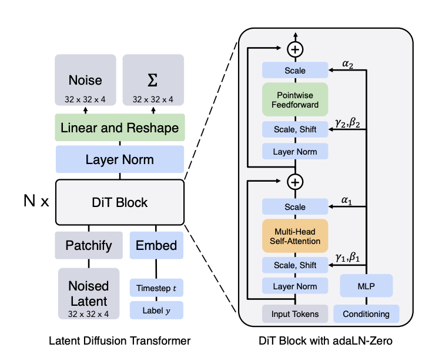
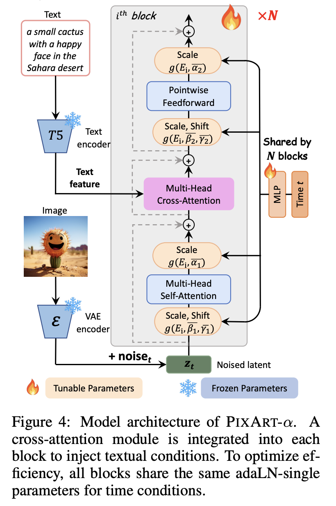
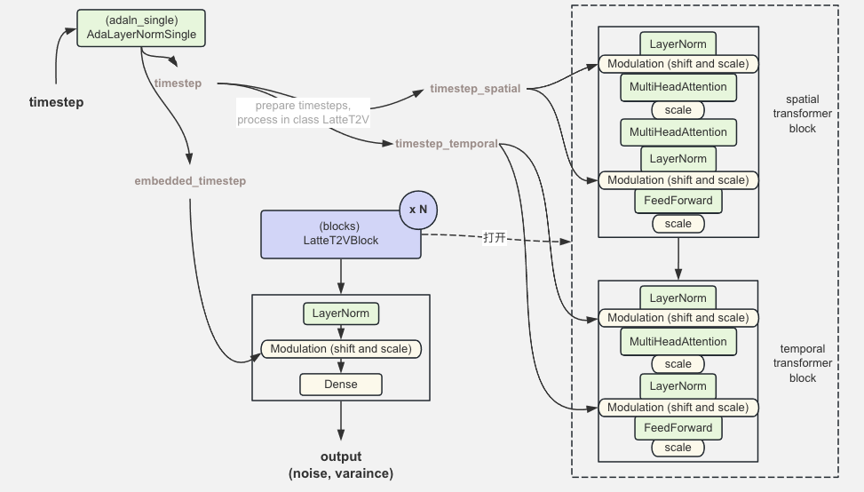

# 自适应归一化层 MindSpore 实现

本文介绍了基于 Mindspore 在 Ascend 910* 上实现自适应归一化模块，并对 mindone套件[opensora-pku latte](https://github.com/mindspore-lab/mindone/tree/master/examples/opensora_pku/opensora/models/diffusion/latte) 默认配置下使用的自适应归一化模块 `AdaLayerNormSingle` 展开代码分析，理解它在 LatteT2V 网络的应用。

## 1. 归一化层 MindSpore 实现
* LayerNorm
* adaLN
* adaLN-zero
* adaLN-single

### 1.1 LayerNorm

层归一化 LayerNorm 在 transformer 模型中很常见，在特征维度上进行标准化，可保留特征之间差异。 $\gamma$ 与 $\beta$ 是可学习的缩放与位移参数。
$$
y = \frac{x - \mathrm{E}[x]}{\sqrt{\mathrm{Var}[x] + \epsilon}} * \gamma + \beta
$$

MindSpore 框架提供了 LayerNorm api, 可以直接通过 `nn.LayerNorm` 调用。


```python
import mindspore as ms
from mindspore import nn

input_tensor = ms.ops.randn(10, 20, 30)
layer_norm = nn.LayerNorm(normalized_shape=(30,))
output = layer_norm(input_tensor)
print("Output shape:", output.shape)
```

    Output shape: (10, 20, 30)


mindSpore.nn.LayerNorm 与 torch.nn.LayerNorm 的主要差异为，后者有入参 `elementwise_affine`, 用于控制是否学习参数 $\gamma$ 与 $\beta$，前者没有该入参，但提供了 `gamma_init` 和`beta_init`入参以控制 $\gamma$ 与 $\beta$ 的初始化方法，详情可查看官网的[差异对比](https://www.mindspore.cn/docs/zh-CN/master/note/api_mapping/pytorch_diff/LayerNorm.html)文档。

我们也可以用 MindSpore 实现与 torch 入参一样的 LayerNorm，通过入参控制是否学习 $\gamma$ 与 $\beta$：


```python
import numbers

import mindspore as ms
from mindspore import Parameter, nn, ops
from mindspore.common.initializer import initializer

class LayerNorm(nn.Cell):
    def __init__(self, normalized_shape, eps=1e-5, elementwise_affine: bool = True, dtype=ms.float32):
        super().__init__()
        if isinstance(normalized_shape, numbers.Integral):
            normalized_shape = (normalized_shape,)
        self.normalized_shape = tuple(normalized_shape)
        self.eps = eps
        self.elementwise_affine = elementwise_affine
        if self.elementwise_affine:
            self.gamma = Parameter(initializer("ones", normalized_shape, dtype=dtype))
            self.beta = Parameter(initializer("zeros", normalized_shape, dtype=dtype))
        else:
            self.gamma = ops.ones(normalized_shape, dtype=dtype)
            self.beta = ops.zeros(normalized_shape, dtype=dtype)
        self.layer_norm = ops.LayerNorm(-1, -1, epsilon=eps)

    def construct(self, x: ms.Tensor):
        oridtype = x.dtype
        x, _, _ = self.layer_norm(x.to(ms.float32), self.gamma.to(ms.float32), self.beta.to(ms.float32))
        return x.to(oridtype)
```

### 1.2 Adaptive layer norm (adaLN)

Diffusion Transformer (DiT) 工作提到 adaptive layer norm (adaLN) 没有像传统的 LayerNorm 一样直接学习 $\gamma$ 与 $\beta$ ，而是注入了条件信息，使用条件嵌入回归学习 $\gamma$ 与 $\beta$。 


```python
class AdaLayerNorm(nn.Cell):
    r"""
    Norm layer modified to incorporate timestep embeddings.
    Parameters:
        embedding_dim (`int`): The size of each embedding vector.
        num_embeddings (`int`): The size of the embeddings dictionary.
    """

    def __init__(self, embedding_dim: int, num_embeddings: int):
        super().__init__()
        self.emb = nn.Embedding(num_embeddings, embedding_dim)
        self.silu = nn.SiLU()
        self.linear = nn.Dense(embedding_dim, embedding_dim * 2)
        self.norm = LayerNorm(embedding_dim, elementwise_affine=False)

    def construct(self, x: ms.Tensor, timestep: ms.Tensor) -> ms.Tensor:
        emb = self.linear(self.silu(self.emb(timestep)))
        scale, shift = ops.chunk(emb, 2)
        x = self.norm(x) * (1 + scale) + shift
        return x
```

###  1.3 Adaptive layer norm zero (adaLN-Zero)

adaLN-Zero 是 DiT 工作提出的创新点之一，除了自适应地学习系数 $\gamma$ 与 $\beta$ ， 还额外学习参数 $\alpha$ , 作用于在残差连接的前一层的偏移。

<p align = "center">    

</p>
<p align="center">
  <em> adaLN-Zero block from DiT paper </em>
</p>


`AdaLayerNormZero` 类的代码实现完成了使用线性投影层（MLP）计算 6 个缩放与位移的权重系数参数， 并完成第一个 norm 的 modulation (scale, shift) 计算，第二个 modulation 以及每个残差连接前的 scale 在一般具体的 transformer block 里实现。

其中， `CombinedTimestepLabelEmbeddings` 是 timestep 与 类别标签的联合嵌入，用于获取条件注入，即图中右下角的 Conditioning 。代码实现可以参考 mindone.diffusers 的 embedding 实现，这里不作展开。


```python
from typing import Tuple
from mindone.diffusers.models.embeddings import CombinedTimestepLabelEmbeddings

class AdaLayerNormZero(nn.Cell):
    r"""
    Norm layer adaptive layer norm zero (adaLN-Zero).
    Parameters:
        embedding_dim (`int`): The size of each embedding vector.
        num_embeddings (`int`): The size of the embeddings dictionary.
    """

    def __init__(self, embedding_dim: int, num_embeddings: int):
        super().__init__()

        self.emb = CombinedTimestepLabelEmbeddings(num_embeddings, embedding_dim)

        self.silu = nn.SiLU()
        self.linear = nn.Dense(embedding_dim, 6 * embedding_dim, bias=True)
        self.norm = LayerNorm(embedding_dim, elementwise_affine=False, eps=1e-6)

    def construct(
        self,
        x: ms.Tensor,
        timestep: ms.Tensor,
        class_labels: ms.Tensor,
        hidden_dtype=None,
    ) -> Tuple[ms.Tensor, ms.Tensor, ms.Tensor, ms.Tensor, ms.Tensor]:
        emb = self.linear(self.silu(self.emb(timestep, class_labels, hidden_dtype=hidden_dtype)))
        shift_msa, scale_msa, gate_msa, shift_mlp, scale_mlp, gate_mlp = emb.chunk(6, dim=1)
        x = self.norm(x) * (1 + scale_msa[:, None]) + shift_msa[:, None]
        return x, gate_msa, shift_mlp, scale_mlp, gate_mlp
```

### 1.4 Adaptive layer norm single (adaLN-single)

adaLN-single 是由 [PixArt-Alpha](https://arxiv.org/abs/2310.00426) 提出的节省参数量的方法，关键点为替代 DiT 的自适应标准化层（adaLN）中的占了27%参数量的线性投影层（MLP）。`AdaLayerNormSingle` 仅使用时间特征嵌入为输入（也可以选择性地联合 size 尺寸条件信息），单独控制尺度和位移，并在所有层共享。每一层又单独设置了可学习的特征嵌入，自适应调节不同层中的尺度和位移参数。

<p align = "center">    

</p>
<p align="center">
  <em> adaLN-Single block from pixart-arpha paper </em>
</p>

可以看到 adaLN, adaLN-Zero, adaLN-single 均使用可学习的增益与偏置参数实现模型的条件注入。


## 2. adaLN-single in LatteT2V

我们针对 LatteT2V 里的具体应用来实现 adaLN-single 方法。在 `AdaLayerNormSingle` 模块里只计算了时间特征编码， modulation 放在 LatteT2V block 里处理。 时间-尺寸联合嵌入层 `CombinedTimestepSizeEmbeddings` 代码可参考 [Latte 条件嵌入层 MindSpore 实现](latte_embedding_modules_implement.md) 2.2.2 小节。


```python
class AdaLayerNormSingle(nn.Cell):
    r"""
    Norm layer adaptive layer norm single (adaLN-single).

    As proposed in PixArt-Alpha (see: https://arxiv.org/abs/2310.00426; Section 2.3).

    Parameters:
        embedding_dim (`int`): The size of each embedding vector.
        use_additional_conditions (`bool`): To use additional conditions for normalization or not.
    """

    def __init__(self, embedding_dim: int, use_additional_conditions: bool = False):
        super().__init__()

        self.emb = CombinedTimestepSizeEmbeddings(
            embedding_dim, size_emb_dim=embedding_dim // 3, use_additional_conditions=use_additional_conditions
        )

        self.silu = nn.SiLU()
        self.linear = nn.Dense(embedding_dim, 6 * embedding_dim)

    def construct(
        self,
        timestep: ms.Tensor,
        added_cond_kwargs: Dict[str, ms.Tensor] = None,
        batch_size: int = None,
        hidden_dtype=None,
    ) -> Tuple[ms.Tensor, ms.Tensor, ms.Tensor, ms.Tensor, ms.Tensor]:
        # No modulation happening here.
        embedded_timestep = self.emb(
            timestep, batch_size=batch_size, hidden_dtype=hidden_dtype, resolution=None, aspect_ratio=None
        )
        return self.linear(self.silu(embedded_timestep)), embedded_timestep
```

下图是使用 adaLN-Single 在 LatteT2V 网络下的使用。`AdaLayerNormSingle` 有两个输出。 `AdaLayerNormSingle` 的第一个 timesteps 嵌入输出作用于LatteT2V block 内的 modulation。第二个输出用于处理 LatteT2V block 后的 modulation。

<p align = "center">    

</p>
<p align="center">
  <em> adaLN-Single and the modulations applied in latteT2V </em>
</p>

把 `LatteT2V` 以及 `LatteT2VBlock` 里的单个 `BasicTransformerBlock` 代码片段与图片展示的 adaLN-Single 方法对应起来看，以下代码片段来自 mindone 仓 opensora-pku 的 latte 实现。

首先看 `LatteT2V` 通过 `AdaLayerNormSingle` 计算得到 2 个 timestep 相关输出：


```python
class LatteT2V(...):
    def __init__(self, ...):

        if norm_type == "ada_norm_single":
            self.adaln_single = AdaLayerNormSingle(inner_dim, use_additional_conditions=self.use_additional_conditions)

    def construct(
            self,
            timesteps,
            ...
    ):
        if self.adaln_single is not None:
            timestep, embedded_timestep = self.adaln_single(
                timestep, added_cond_kwargs, batch_size=batch_size, hidden_dtype=hidden_states.dtype
            )
            
        ...
```

第一个输出 `timestep` 作用于 `LatteT2VBlock` 内部的 transformer block。 由于单个 `LatteT2VBlock` 为空间 transformer block + 时间  transformer block 组成，`timestep` 将在两个特征维度处理块各自融合信息，因此输入`LatteT2VBlock` 之前先通过 `mindspore.Tensor.repeat_interleave` 分别沿着时间特征轴与空间特征轴重复张量。


```python
# in LatteT2V construct function
    ...
        # prepare timesteps for spatial and temporal block
        # b d -> (b f) d ，视频时间方向（帧维度）重复处理
        timestep_spatial = timestep.repeat_interleave(frame + use_image_num, dim=0)
        # b d -> (b p) d ，视频空间方向（图块）重复处理
        timestep_temp = timestep.repeat_interleave(num_patches, dim=0)

        # 此处的 block 指的是 时空交错的 Latte T2V blcok
        for i, block in enumerate(self.blocks):
            hidden_states = block(
                ...,
                timestep_spatial,
                timestep_temp,
                ...
            )

    ... 
```

我们还可以打开看看 timestep 嵌入进到 `LatteT2VBlock` 后的 modulation 操作代码片段。下面的片段以 `timestep_spatial` 进入 空间 transformer block 为例。`timestep_temp` 作用于 时间 transformer block 的 modulation 操作也是类似的。


```python
class BasicTransformerBlock(nn.Cell):
    ...
    def __init__(...):
        super().__init__()
        # 1. Self-Attn
        self.norm1_ln = LayerNorm(...)
        self.attn1 = MultiHeadAttention(...
        # 2. Cross-Attn
        self.norm2_ln = LayerNorm(...)
        self.attn2 = MultiHeadAttention(...)  # is self-attn if encoder_hidden_states is none
        # 3. Feed-forward
        self.norm3 = LayerNorm(...)
        self.ff = FeedForward(...)
        # Scale-shift for PixArt-Alpha.
        self.scale_shift_table = ms.Parameter(ops.randn(6, dim) / dim**0.5)

    def construct(
        self,
        ...,
        timestep: Optional[ms.Tensor] = None,
        ...,
        )
        ...
        
        shift_msa, scale_msa, gate_msa, shift_mlp, scale_mlp, gate_mlp = (
            self.scale_shift_table[None] + timestep.reshape(batch_size, 6, -1)
        ).chunk(6, axis=1)
        norm_hidden_states = self.norm1_ln(hidden_states)
        norm_hidden_states = norm_hidden_states * (1 + scale_msa) + shift_msa

        attn_output = self.attn1(...)
        attn_output = gate_msa * attn_output
        hidden_states = attn_output + hidden_states
    
        # 2. Cross-Attention
        if self.use_ada_layer_norm_single:
                # For PixArt norm2 isn't applied here:
                # https://github.com/PixArt-alpha/PixArt-alpha/blob/0f55e922376d8b797edd44d25d0e7464b260dcab/diffusion/model/nets/PixArtMS.py#L70C1-L76C103
                norm_hidden_states = hidden_states
        attn_output = self.attn2(...)
        hidden_states = attn_output + hidden_states

        # 4. Feed-forward
        norm_hidden_states = self.norm2_ln(hidden_states)
        norm_hidden_states = norm_hidden_states * (1 + scale_mlp) + shift_mlp
        ff_output = gate_mlp * ff_output
        hidden_states = ff_output + hidden_states
        ...

        return hidden_states

```

现在回到 `AdaLayerNormSingle` 的第二个输出 `embedded_timestep`，看看它作用于 n 个 `LatteT2VBlock` 计算结束后的 modulation 操作的代码实现：


```python
class LatteT2V(...):
    def __init__(self, ...):
        ...

        if self.is_input_patches and norm_type == "ada_norm_single":
            self.norm_out = LayerNorm(inner_dim, elementwise_affine=False, eps=1e-6)
            self.scale_shift_table = ms.Parameter(ops.randn(2, inner_dim) / inner_dim**0.5)
            self.proj_out = nn.Dense(inner_dim, patch_size * patch_size * self.out_channels)
        ...

    def construct(
            self,
            timesteps,
            ...
    ):
    ，，，
        for i, block in enumerate(self.blocks):
            hidden_states = block(
                ...,
                timestep_spatial,
                timestep_temp,
                ...
            )

        if self.norm_type == "ada_norm_single":
            # b d -> (b f) d
            embedded_timestep = embedded_timestep.repeat_interleave(frame + use_image_num, dim=0)
            shift, scale = (self.scale_shift_table[None] + embedded_timestep[:, None]).chunk(2, axis=1)
            hidden_states = self.norm_out(hidden_states)
            # Modulation
            hidden_states = hidden_states * (1 + scale) + shift
            hidden_states = self.proj_out(hidden_states)
    ...

```

## 3. 扩展阅读

本文介绍了自适应归一化模块的 MindSpore 实现，并分析了 mindone套件[opensora-pku latte](https://github.com/mindspore-lab/mindone/tree/master/examples/opensora_pku/opensora/models/diffusion/latte) 实现 `AdaLayerNormSingle` 的代码。

`LatteT2V` 完整 MindSpore 实现代码可参考 `mindone` 仓： [examples/opensora_pku/opensora/models/diffusion/latte](https://github.com/mindspore-lab/mindone/tree/master/examples/opensora_pku/opensora/models/diffusion/latte)

`mindone` 套件仓已兼容 diffusers，可参考 `mindone.diffusers.models.normalization` 查看其他归一化层的 MindSpore 实现：[mindone/diffusers/models/normalization.py](https://github.com/mindspore-lab/mindone/blob/master/mindone/diffusers/models/normalization.py)


论文阅读：
- DiT （AdaLN-Zero 在 3.2 小节）: https://arxiv.org/pdf/2212.09748
- PixArt-Alpha（AdaLN-single 在 2.3 小节）: https://arxiv.org/pdf/2310.00426
- Latte: https://arxiv.org/pdf/2401.03048