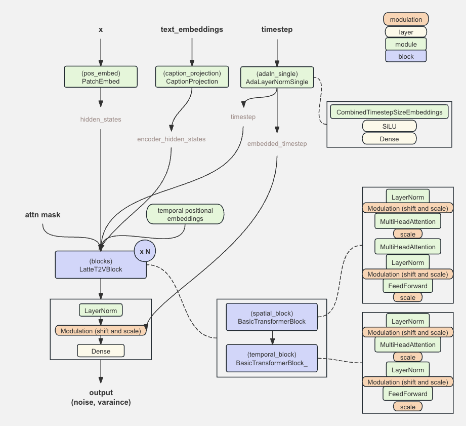
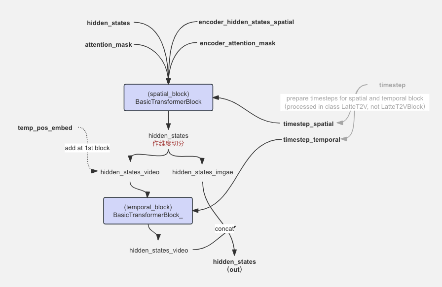

# Latte 简介与 MindSpore 实现

本文介绍如何使用 Mindspore 在 Ascend 910* 上从零到一构建 OpenSora-PKU 中用到的 Latte 文生视频的噪声预测模型，主要代码参考自mindone套件[opensora-pku](https://github.com/mindspore-lab/mindone/tree/master/examples/opensora_pku/opensora/models/diffusion/latte)里的 Latte 实现。

## 1. Latte T2V 结构简介

[Latte: Latent Diffusion Transformer for Video Generation](https://arxiv.org/abs/2401.03048) 是以隐空间视频 transformer 为骨干的扩散模型，能有效地捕捉视频中的时空信息，扩展到文本到视频生成（T2V）任务并取得一定效果。 原论文从分解输入视频的空间、时间维度的角度提出 Latte 的4种变体，OpenSora-PKU 使用的 LatteT2V 主要参考了其中的时空交错式设计： Transformer 骨干由空间 transformer block 与时间 transformer block 交替进行。另外，Latte 使用了图像-视频联合训练进行学习， 可提升生成视频的质量。

LatteT2V 网络的整体代码结构如下，默认配置下归一化层使用 adaln-single 方法。


<p align = "center">    

</p>
<p align="center">
  <em> latteT2V net in open-sora pku</em>
</p>

按照结构图，LatteT2V 的构建 Latte 使用的小模块可简单分为条件嵌入类、归一化层、注意力机制模块：

条件嵌入可参考 [Latte 条件嵌入层 MindSpore 实现](./latte_embedding_modules_implement.md):

* position utils - 三角函数位置编码函数
    * get_1d_sincos_pos_embed ✔️
    * get_2d_sincos_pos_embed ✔️

* embeddings - 嵌入层
    * PatchEmbed ✔️
    * CombinedTimestepSizeEmbeddings ✔️
    * CaptionProjection ✔️

归一化层可参考 [自适应归一化层 MindSpore 实现](./latte_adalayernorm_implement.md):

* normalization - 归一化层
    * LayerNorm ✔️
    * AdaLayerNorm ✔️

注意力机制可参考 [Latte 多头注意力模块的 MindSpore 实现](./latte_mha_implement.md):
* attentions - 注意力机制
    * MultiHeadAttention  ✔️
    * FeedForward  ✔️

## 2. LatteT2VBlock 构建


OpenSora-PKU 的 latte 采用了论文中的第一种变体设计：空间、时间特征分别由单一的 transformer block 处理，空间 transformer block 与时间 transformer block 交替进行，组成一个 `LatteT2VBlock`。

单个基本的 transformer block MindSpore 实现可参考[Latte BasicTransformerBlock MindSpore 实现](./latte_transformerblock_implement.md):

* 单个 Transformer Block：
    * `BasicTransformerBlock` - 空间特征处理模块
    * `BasicTransformerBlock_` - 时间特征处理模块

LatteT2VBlock 的实现细节如下图所示。提取空间特征的 transformer block 输入同时有视频和文本的信息，空间 block 内做 self-attention 与 cross-attention ，其中文本与视觉的信息对齐通过模块里第二个交叉注意力机制实现。提取时间特征的 transformer block 对视频输入的时间特征进行学习，只做 self-attention 。 
    
Latte 使用了图像-视频联合训练进行学习， 可提升生成视频的质量。 视频和图像生成的同时训练的实现方法是将同一数据集中随机独立采样视频帧，加到视频的末尾；`LatteT2VBlock` 的 `construct` 入参 `frame` 则表示连续视频的帧数， `use_image_num` 指的是在连续视频中采样的图片帧数，补在了视频的最后。为了不影响视频连续性的学习，与连续视频相关的内容才会被输入学习时间信息的 transformer block， 而采样图片的部分则排除在外，不参与时间模块学习。因此空间 block 的输出先做维度切分，分成 video 的部分与 image 的部分，video 的部分经过时间特征处理模块的学习后再与 image 部分拼接后输出。

timesteps 信息在 LatteT2V net （而非 LatteT2V block）中做了维度处理，以适配空间 transformer 块与时间 transformer 块的维度输入。timesteps 输入的作用为：在 transformer 块内部通过自适应归一化方法实现扩散过程中的时间戳条件注入。

<p align = "center">    

</p>
<p align="center">
  <em> basic transformer blocks in one LatteT2V block</em>
</p>


```python
import logging
from typing import Any, Dict, Optional
import numpy as np
import mindspore as ms
from mindspore import nn, ops
logger = logging.getLogger(__name__)

# clone mindone, cd examples/opensora_pku
from opensora.models.diffusion.latte.modules import (
    AdaLayerNormSingle,
    BasicTransformerBlock,
    BasicTransformerBlock_,
    CaptionProjection,
    LatteT2VBlock,
    LayerNorm,
    PatchEmbed,
)

class LatteT2VBlock(nn.Cell):
    def __init__(self, block_id, temp_pos_embed, spatial_block, temp_block):
        super().__init__()
        self.spatial_block = spatial_block
        self.temp_block = temp_block
        self.is_first_block = block_id == 0
        self.temp_pos_embed = temp_pos_embed

    def construct(
        self,
        hidden_states: ms.Tensor,
        class_labels: Optional[ms.Tensor] = None,
        cross_attention_kwargs: Dict[str, Any] = None,
        attention_mask: Optional[ms.Tensor] = None,
        encoder_hidden_states_spatial: Optional[ms.Tensor] = None,
        timestep_spatial: Optional[ms.Tensor] = None,
        timestep_temp: Optional[ms.Tensor] = None,
        encoder_attention_mask: Optional[ms.Tensor] = None,
        use_image_num: int = 0,
        input_batch_size: int = 0,
        frame: int = 0,
        enable_temporal_attentions: bool = True,
    ):
        hidden_states = self.spatial_block(
            hidden_states,
            attention_mask,
            encoder_hidden_states_spatial,
            encoder_attention_mask,
            timestep_spatial,
            cross_attention_kwargs,
            class_labels,
        )

        if enable_temporal_attentions:
            # b c f h w, f = 16 + 4
            # (b f) t d -> (b t) f d
            hidden_states = hidden_states.view(input_batch_size, frame + use_image_num, -1, hidden_states.shape[-1])
            hidden_states = hidden_states.permute(0, 2, 1, 3).view(-1, frame + use_image_num, hidden_states.shape[-1])

            if use_image_num != 0 and self.training:
                hidden_states_video = hidden_states[:, :frame, ...]
                hidden_states_image = hidden_states[:, frame:, ...]
                if self.is_first_block:
                    hidden_states_video = hidden_states_video + self.temp_pos_embed

                hidden_states_video = self.temp_block(
                    hidden_states_video,
                    None,  # attention_mask
                    None,  # encoder_hidden_states
                    None,  # encoder_attention_mask
                    timestep_temp,
                    cross_attention_kwargs,
                    class_labels,
                )

                hidden_states = ops.cat([hidden_states_video, hidden_states_image], axis=1)
                # (b t) f d -> (b f) t d
                hidden_states = hidden_states.view(input_batch_size, -1, frame + use_image_num, hidden_states.shape[-1])
                hidden_states = hidden_states.permute(0, 2, 1, 3).view(
                    input_batch_size * (frame + use_image_num), -1, hidden_states.shape[-1]
                )

            else:
                if self.is_first_block:
                    hidden_states = hidden_states + self.temp_pos_embed

                hidden_states = self.temp_block(
                    hidden_states,
                    None,  # attention_mask
                    None,  # encoder_hidden_states
                    None,  # encoder_attention_mask
                    timestep_temp,
                    cross_attention_kwargs,
                    class_labels,
                )
                # (b t) f d -> (b f) t d
                hidden_states = hidden_states.view(input_batch_size, -1, frame + use_image_num, hidden_states.shape[-1])
                hidden_states = hidden_states.permute(0, 2, 1, 3).view(
                    input_batch_size * (frame + use_image_num), -1, hidden_states.shape[-1]
                )
        return hidden_states
```

## 3. LatteT2V 网络搭建

现在我们已经可以按照第 1 小结的结构图，构建 LatteT2V 网络。在网络的初始化函数中，主要的定义步骤为：
1，计算网络输入的嵌入层，包含视频空间嵌入、时间嵌入、文本嵌入映射层
2. 定义空间、时间transformer 块，交错组合成单个Latte T2V 块，并按照输入的层数搭建整个网络
3. 定义输出层，包括输出的线性映射、ada_norm_single 方法的增益与偏置计算的参数。

模型前向计算输入：

- `hidden_states` : 经过 vae 编码的 latents， 形状为 (batch size, frame, input_channel, height, width)
- `encoder_hidden_states`: text encoder 的文本嵌入，作为 transformer blocks 的 cross-attention 的输入之一，在空间特征学习模块的第二个注意力机制模块使用；
- `attention_mask`: 应用于 `hidden_states` 的掩码。  *optional*
- `encoder_attention_mask`： 应用于 `encoder_hidden_states` 的掩码。  *optional*
- `timestep` : 扩散过程的时间戳，如果使用自适应归一化层如`AdaLayerNorm`， `AdaLayerNormSingle` ，将作为其信息注入。 *optional*
- `class_labels` : 使用类别条件引导生产时有。如果使用 `AdaLayerZeroNorm`， 将作为其信息注入。 *optional*
- `added_cond_kwargs` : 参考嵌入层实现的 `CombinedTimestepSizeEmbeddings` 构建小节， timesteps 以外的 size 信息，通过这个参数字典传入。*optional*
- `cross_attention_kwargs` : 传入 transformer blocks - cross-attention 的参数字典。*optional*
- `use_image_num`: 指 Latte 视频-图像混合训练时，从视频采样出图像的数量。

输出：

- `outout` : 形状为  (batch size, frame, output_channel, height, width), 其中 output_channel = input_channel * 2, 表示 Latte 学习/预测的 noise 与 variance。


```python
from mindone.diffusers.configuration_utils import ConfigMixin, register_to_config
from mindone.diffusers.models.modeling_utils import ModelMixin

class LatteT2V(ModelMixin, ConfigMixin):
    _supports_gradient_checkpointing = True

    @register_to_config
    def __init__(
        self,
        num_attention_heads: int = 16,
        attention_head_dim: int = 72,
        in_channels: Optional[int] = None,
        out_channels: Optional[int] = None,
        num_layers: int = 1,
        dropout: float = 0.0,
        norm_num_groups: int = 32,
        cross_attention_dim: Optional[int] = None,
        attention_bias: bool = False,
        sample_size: Optional[int] = None,
        patch_size: Optional[int] = None, #2
        activation_fn: str = "geglu",
        num_embeds_ada_norm: Optional[int] = None,
        use_linear_projection: bool = False,
        only_cross_attention: bool = False,
        double_self_attention: bool = False,
        upcast_attention: bool = False,
        norm_type: str = "ada_norm_single",
        norm_elementwise_affine: bool = True,
        norm_eps: float = 1e-5,
        attention_type: str = "default",
        caption_channels: int = None,
        video_length: int = 16,
        enable_flash_attention: bool = False,
        use_recompute=False,
    ):
        super().__init__()
        self.num_attention_heads = num_attention_heads #16
        self.attention_head_dim = attention_head_dim #72
        inner_dim = num_attention_heads * attention_head_dim #1152
        self.video_length = video_length #5
        self.norm_type = norm_type #ada_norm_single
        self.use_recompute = use_recompute

        # 1. here we set the input as patches input
        self.is_input_patches = in_channels is not None and patch_size is not None #TRUE
        assert self.is_input_patches, "In this tutorial we implement patch input"


        # 2. Define input layers
        assert sample_size is not None, "Transformer2DModel over patched input must provide sample_size"

        self.height = sample_size[0] if isinstance(sample_size, (tuple, list)) else sample_size
        self.width = sample_size[1] if isinstance(sample_size, (tuple, list)) else sample_size

        self.patch_size = patch_size
        if isinstance(self.config.sample_size, (tuple, list)):
            interpolation_scale = self.config.sample_size[0] // 64  # => 64 (= 512 pixart) has interpolation scale 1
        else:
            interpolation_scale = self.config.sample_size // 64
        interpolation_scale = max(interpolation_scale, 1)
        self.pos_embed = PatchEmbed(
            height=sample_size[0] if isinstance(sample_size, (tuple, list)) else sample_size,
            width=sample_size[1] if isinstance(sample_size, (tuple, list)) else sample_size,
            patch_size=patch_size,
            in_channels=in_channels,
            embed_dim=inner_dim,
            interpolation_scale=interpolation_scale,
        )

        # 3. Define transformers blocks, spatial attention
        self.transformer_blocks = [
            BasicTransformerBlock(
                inner_dim,
                num_attention_heads,
                attention_head_dim,
                dropout=dropout,
                cross_attention_dim=cross_attention_dim,
                activation_fn=activation_fn,
                attention_bias=attention_bias,
                only_cross_attention=only_cross_attention,
                double_self_attention=double_self_attention,
                upcast_attention=upcast_attention,
                norm_type=norm_type,
                norm_elementwise_affine=norm_elementwise_affine,
                norm_eps=norm_eps,
                attention_type=attention_type,
                enable_flash_attention=enable_flash_attention,
            )
            for d in range(num_layers)
        ]

        # Define temporal transformers blocks
        self.temporal_transformer_blocks = [
            BasicTransformerBlock_(  # one attention
                inner_dim,
                num_attention_heads,  # num_attention_heads
                attention_head_dim,  # attention_head_dim 72
                dropout=dropout,
                cross_attention_dim=None,
                activation_fn=activation_fn,
                attention_bias=attention_bias,
                only_cross_attention=only_cross_attention,
                double_self_attention=False,
                upcast_attention=upcast_attention,
                norm_type=norm_type,
                norm_elementwise_affine=norm_elementwise_affine,
                norm_eps=norm_eps,
                attention_type=attention_type,
                enable_flash_attention=enable_flash_attention,
            )
            for d in range(num_layers)
        ]

        # 4. Define output layers
        self.out_channels = in_channels if out_channels is None else out_channels

        # self.is_input_patches and norm_type == "ada_norm_single":
        self.norm_out = LayerNorm(inner_dim, elementwise_affine=False, eps=1e-6)
        self.scale_shift_table = ms.Parameter(ops.randn(2, inner_dim) / inner_dim**0.5)
        self.proj_out = nn.Dense(inner_dim, patch_size * patch_size * self.out_channels)

        # 5. PixArt-Alpha blocks.
        self.adaln_single = None
        self.use_additional_conditions = False
        if norm_type == "ada_norm_single":
            self.adaln_single = AdaLayerNormSingle(inner_dim, use_additional_conditions=self.use_additional_conditions)

        # 6. caption projection
        self.caption_projection = None
        if caption_channels is not None:
            self.caption_projection = CaptionProjection(in_features=caption_channels, hidden_size=inner_dim)

        self.gradient_checkpointing = False

        # 7. define temporal positional embedding
        interpolation_scale = self.config.video_length // 5  # => 5 (= 5 our causalvideovae) has interpolation scale 1
        interpolation_scale = max(interpolation_scale, 1)
        temp_pos_embed = get_1d_sincos_pos_embed(
            inner_dim, video_length, interpolation_scale=interpolation_scale
        )  # 1152 hidden size

        self.temp_pos_embed = ms.Tensor(temp_pos_embed).float().unsqueeze(0)

        # 8. the latte T2V 
        self.blocks = nn.CellList(
            [
                LatteT2VBlock(d, self.temp_pos_embed, self.transformer_blocks[d], self.temporal_transformer_blocks[d])
                for d in range(num_layers)
            ]
        )

        if self.use_recompute:
            for block in self.blocks:
                self.recompute(block)

    def construct(
        self,
        hidden_states: ms.Tensor, # (4,4,9,32,32)
        timestep: Optional[ms.Tensor] = None, #(4,)
        encoder_hidden_states: Optional[ms.Tensor] = None, #(4,5,300,4096)
        added_cond_kwargs: Dict[str, ms.Tensor] = None,
        class_labels: Optional[ms.Tensor] = None,
        cross_attention_kwargs: Dict[str, Any] = None,
        attention_mask: Optional[ms.Tensor] = None,
        encoder_attention_mask: Optional[ms.Tensor] = None, # 4,5,300
        use_image_num: int = 0,
        enable_temporal_attentions: bool = True,
    ):

        input_batch_size, c, frame, h, w = hidden_states.shape

        frame = frame - use_image_num  # 20-4=16
        # b c f h w -> (b f) c h w
        hidden_states = hidden_states.permute(0, 2, 1, 3, 4).reshape(
            input_batch_size * (frame + use_image_num), c, h, w
        )
        if attention_mask is not None and attention_mask.ndim == 2:
            attention_mask = attention_mask.unsqueeze(1)
            attention_mask = attention_mask.to(self.dtype)
        # 1 + 4, 1 -> video condition, 4 -> image condition
        # convert encoder_attention_mask to a bias the same way we do for attention_mask
        if encoder_attention_mask is not None and encoder_attention_mask.ndim == 2:  # ndim == 2 means no image joint
            encoder_attention_mask = encoder_attention_mask.unsqueeze(1)
            # b 1 l -> (b f) 1 l
            encoder_attention_mask = encoder_attention_mask.repeat_interleave(frame, dim=0)
            encoder_attention_mask = encoder_attention_mask.to(self.dtype)
        elif encoder_attention_mask is not None and encoder_attention_mask.ndim == 3:  # ndim == 3 means image joint
            encoder_attention_mask_video = encoder_attention_mask[:, :1, ...]
            encoder_attention_mask_video = encoder_attention_mask_video.repeat_interleave(frame, dim=1)
            encoder_attention_mask_image = encoder_attention_mask[:, 1:, ...]
            encoder_attention_mask = ops.cat([encoder_attention_mask_video, encoder_attention_mask_image], axis=1)
            # b n l -> (b n) l
            encoder_attention_mask = encoder_attention_mask.view(-1, encoder_attention_mask.shape[-1]).unsqueeze(1)
            encoder_attention_mask = encoder_attention_mask.to(self.dtype)

        # 1. Input
        height, width = hidden_states.shape[-2] // self.patch_size, hidden_states.shape[-1] // self.patch_size
        num_patches = height * width

        hidden_states = self.pos_embed(hidden_states.to(self.dtype))  # alrady add positional embeddings

        if self.adaln_single is not None:
            if self.use_additional_conditions and added_cond_kwargs is None:
                raise ValueError(
                    "`added_cond_kwargs` cannot be None when using additional conditions for `adaln_single`."
                )
            # batch_size = hidden_states.shape[0]
            batch_size = input_batch_size
            timestep, embedded_timestep = self.adaln_single(
                timestep, added_cond_kwargs, batch_size=batch_size, hidden_dtype=hidden_states.dtype
            )
        else:
            embedded_timestep = None

        # 2. Blocks
        if self.caption_projection is not None:
            batch_size = hidden_states.shape[0]
            encoder_hidden_states = self.caption_projection(encoder_hidden_states.to(self.dtype))  # 3 120 1152

            if use_image_num != 0 and self.training:
                encoder_hidden_states_video = encoder_hidden_states[:, :1, ...]
                # b 1 t d -> b (1 f) t d
                encoder_hidden_states_video = encoder_hidden_states_video.repeat_interleave(frame, dim=1)
                encoder_hidden_states_image = encoder_hidden_states[:, 1:, ...]
                encoder_hidden_states = ops.cat([encoder_hidden_states_video, encoder_hidden_states_image], axis=1)
                # b f t d -> (b f) t d
                encoder_hidden_states_spatial = encoder_hidden_states.view(
                    -1, encoder_hidden_states.shape[-2], encoder_hidden_states.shape[-1]
                )
            else:
                # b t d -> (b f) t d
                encoder_hidden_states_spatial = encoder_hidden_states.repeat_interleave(frame, dim=0)
        else:
            encoder_hidden_states_spatial = encoder_hidden_states.repeat_interleave(frame, dim=0)  

        # prepare timesteps for spatial and temporal block
        # b d -> (b f) d
        timestep_spatial = timestep.repeat_interleave(frame + use_image_num, dim=0)
        # b d -> (b p) d
        timestep_temp = timestep.repeat_interleave(num_patches, dim=0)

        for block in self.blocks:
            hidden_states = block(
                hidden_states,
                class_labels,
                cross_attention_kwargs,
                attention_mask,
                encoder_hidden_states_spatial,
                timestep_spatial,
                timestep_temp,
                encoder_attention_mask,
                use_image_num,
                input_batch_size,
                frame,
                enable_temporal_attentions,
            )

        # self.norm_type == "ada_norm_single"
        # b d -> (b f) d
        assert embedded_timestep is not None, "embedded_timestep is expected to be not None"
        embedded_timestep = embedded_timestep.repeat_interleave(frame + use_image_num, dim=0)
        shift, scale = (self.scale_shift_table[None] + embedded_timestep[:, None]).chunk(2, axis=1)
        hidden_states = self.norm_out(hidden_states)
        # Modulation
        hidden_states = hidden_states * (1 + scale) + shift
        hidden_states = self.proj_out(hidden_states)

        # unpatchify
        # self.norm_type == "ada_norm_single"
        height = width = int(hidden_states.shape[1] ** 0.5)

        hidden_states = hidden_states.reshape(-1, height, width, self.patch_size, self.patch_size, self.out_channels)
        # nhwpqc->nchpwq
        hidden_states = hidden_states.permute(0, 5, 1, 3, 2, 4)
        output = hidden_states.reshape(-1, self.out_channels, height * self.patch_size, width * self.patch_size)
        # (b f) c h w -> b c f h w
        output = output.view(
            input_batch_size, frame + use_image_num, output.shape[-3], output.shape[-2], output.shape[-1]
        )
        output = output.permute(0, 2, 1, 3, 4)
        return output
```

OpenSora-PKU 使用 LatteT2V_XL_122 规格，其中 `num_layers` 表示 `LatteT2VBlock` 的个数。 


```python
def LatteT2V_XL_122(**kwargs):
    return LatteT2V(
        num_layers=28,
        attention_head_dim=72,
        num_attention_heads=16,
        patch_size=2,
        norm_type="ada_norm_single",
        caption_channels=4096,
        cross_attention_dim=1152,
        **kwargs,
    )
```

我们可以初始化一个 Latte model 并打印网络结构：


```python
latte_model = LatteT2V_XL_122(
    in_channels=4,
    out_channels=4 * 2,
    attention_bias=True,
    sample_size=(32, 32),
    activation_fn="gelu-approximate",
    use_linear_projection=False,
    only_cross_attention=False,
    double_self_attention=False,
    upcast_attention=False,
    norm_elementwise_affine=False,
    norm_eps=1e-6,
    attention_type="default",
    video_length=5,
)
```


```python
print(latte_model)
```

    LatteT2V<
      (pos_embed): PatchEmbed<
        (proj): Conv2d<input_channels=4, output_channels=1152, kernel_size=(2, 2), stride=(2, 2), pad_mode=same, padding=0, dilation=(1, 1), group=1, has_bias=True, weight_init=<mindspore.common.initializer.HeUniform object at 0x7f7f2f133af0>, bias_init=<mindspore.common.initializer.Uniform object at 0x7f7f2f1335e0>, format=NCHW>
        >
      (norm_out): LayerNorm<>
      (proj_out): Dense<input_channels=1152, output_channels=32, has_bias=True>
      (adaln_single): AdaLayerNormSingle<
        (emb): CombinedTimestepSizeEmbeddings<
          (time_proj): Timesteps<>
          (timestep_embedder): TimestepEmbedding<
            (linear_1): Dense<input_channels=256, output_channels=1152, has_bias=True>
            (act): SiLU<>
            (linear_2): Dense<input_channels=1152, output_channels=1152, has_bias=True>
            >
          >
        (silu): SiLU<>
        (linear): Dense<input_channels=1152, output_channels=6912, has_bias=True>
        >
      (caption_projection): CaptionProjection<
        (linear_1): Dense<input_channels=4096, output_channels=1152, has_bias=True>
        (act_1): GELU<>
        (linear_2): Dense<input_channels=1152, output_channels=1152, has_bias=True>
        >
      (blocks): CellList<
        (0): LatteT2VBlock<
          (spatial_block): BasicTransformerBlock<
            (norm1_ln): LayerNorm<>
            (attn1): MultiHeadAttention<
              (to_q): Dense<input_channels=1152, output_channels=1152, has_bias=True>
              (to_k): Dense<input_channels=1152, output_channels=1152, has_bias=True>
              (to_v): Dense<input_channels=1152, output_channels=1152, has_bias=True>
              (to_out): SequentialCell<
                (0): Dense<input_channels=1152, output_channels=1152, has_bias=True>
                (1): Dropout<p=0.0>
                >
              (attention): Attention<
                (attn_drop): Dropout<p=0.0>
                >
              >
            (norm2_ln): LayerNorm<>
            (attn2): MultiHeadAttention<
              (to_q): Dense<input_channels=1152, output_channels=1152, has_bias=True>
              (to_k): Dense<input_channels=1152, output_channels=1152, has_bias=True>
              (to_v): Dense<input_channels=1152, output_channels=1152, has_bias=True>
              (to_out): SequentialCell<
                (0): Dense<input_channels=1152, output_channels=1152, has_bias=True>
                (1): Dropout<p=0.0>
                >
              (attention): Attention<
                (attn_drop): Dropout<p=0.0>
                >
              >
            (norm3): LayerNorm<>
            (ff): FeedForward<
              (net): CellList<
                (0): GELU<
                  (proj): Dense<input_channels=1152, output_channels=4608, has_bias=True>
                  >
                (1): Dropout<p=0.0>
                (2): Dense<input_channels=4608, output_channels=1152, has_bias=True>
                >
              >
            >
          (temp_block): BasicTransformerBlock_<
            (norm1_ln): LayerNorm<>
            (attn1): MultiHeadAttention<
              (to_q): Dense<input_channels=1152, output_channels=1152, has_bias=True>
              (to_k): Dense<input_channels=1152, output_channels=1152, has_bias=True>
              (to_v): Dense<input_channels=1152, output_channels=1152, has_bias=True>
              (to_out): SequentialCell<
                (0): Dense<input_channels=1152, output_channels=1152, has_bias=True>
                (1): Dropout<p=0.0>
                >
              (attention): Attention<
                (attn_drop): Dropout<p=0.0>
                >
              >
            (norm3): LayerNorm<>
            (ff): FeedForward<
              (net): CellList<
                (0): GELU<
                  (proj): Dense<input_channels=1152, output_channels=4608, has_bias=True>
                  >
                (1): Dropout<p=0.0>
                (2): Dense<input_channels=4608, output_channels=1152, has_bias=True>
                >
              >
            >
          >
          
        ......(一共28个LatteT2VBlock)......
    
        (27): LatteT2VBlock<
        ...
        >
      >


## 4. 扩展阅读

本文介绍如何使用 Mindspore 在 Ascend 910* 上从构建 OpenSora-PKU 中用到的 Latte 文生视频的噪声预测模型，完整版代码可参考 mindone套件[opensora-pku](https://github.com/mindspore-lab/mindone/tree/master/examples/opensora_pku) 里的 Latte 实现: [examples/opensora_pku/opensora/models/diffusion/latte/modeling_latte.py](https://github.com/mindspore-lab/mindone/blob/master/examples/opensora_pku/opensora/models/diffusion/latte/modeling_latte.py)

论文阅读：
- Latte: [Latent Diffusion Transformer for Video Generation](https://arxiv.org/abs/2401.03048)


