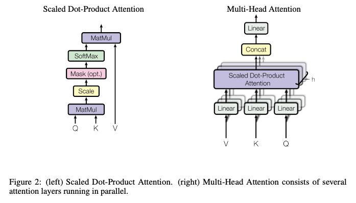

# Latte 多头注意力模块的 MindSpore 实现

本文介绍如何基于 Mindspore 在 Ascend 910* 上实现 Latte 网络 transformer block 使用的多头注意力模块（MHA），代码参考自mindone套件[opensora-pku](https://github.com/mindspore-lab/mindone/tree/master/examples/opensora_pku/opensora/models/diffusion/latte) Latte transformer block 使用的 `MultiHeadAttention`。

## 1. 注意力机制简介

注意力是一种机制，核心逻辑是通过权重的分配从全部关注到重点关注，模型可以通过注意力机制来控制输入的不同部分的重要程度。多头注意力通过使用多个注意力，对多组注意力计算结果做拼接与线性投影，模型可以同时关注来自不同表示子空间信息，达到全局更好的理解与表达。下图为原论文[Attention is all you need]() 对单注意力机制与多头注意力机制的结构图：

<p align = "center">    

</p>
<p align="center">
  <em> attention and muti-head attention</em>
</p>

## 2. 注意力机制 MindSpore 实现

### 2.1 单注意力

按原论文描述，注意力机制可以定义为将 query (Q) 和 键-值对 （K-V) 映射到一个输出，其中query，keys，values和输出均是向量。输出是对 values 的加权求和，其中每个 value 的权重通过 query 与相应 key 来计算， 公式如下：

$$
Attention(Q, K, V) = softmax(\frac{QK^T}{\sqrt d})V
$$


下面的 MindSpore 代码按照公式，输入 q，k，v，实现下列步骤：

- 计算 Q 向量与每个 K 向量的点积
- 将结果除以 K 向量维度 d 的平方根，这一步是为了抵消第 1 步当维度 d 太大时点积增幅度大，可能导致 softmax 差异太小的影响
- （optional） 使用掩码，使得无效部分对模型的影响接近0
- 将结果输入 softmax 函数以获得注意力权重
- 将每个 V 向量乘以注意力权重（即注意力得分），得到加权输出

`Attention` 的初始化参数 `upcast_attention`, `upcast_softmax` 表示是否强制转换为 fp32 计算。注意：`ops.matmul` 的两个输入数据精度类型需保持一致，比如不能一个输入为 fp16 另一个为 fp32。


```python
import mindspore as ms
from mindspore import Parameter, nn, ops
from mindspore.common.initializer import initializer

class Attention(nn.Cell):
    def __init__(self, dim_head, attn_drop=0.0, upcast_attention=False, upcast_softmax=True):
        super().__init__()
        self.scale = dim_head**-0.5
        self.attn_drop = nn.Dropout(p=attn_drop)
        self.upcast_attention = upcast_attention
        self.upcast_softmax = upcast_softmax

    def construct(self, q, k, v, mask=None):
        if self.upcast_attention:
            q, k, v = [x.astype(ms.float32) for x in (q, k, v)]
        sim = ops.matmul(q, ops.transpose(k, (0, 2, 1))) * self.scale
        if self.upcast_softmax:
            sim = sim.astype(ms.float32)
        if mask is not None:
            # (b*h 1 n_k)
            # convert mask into a bias that can be added to attention scores:
            #       (keep = +0,     discard = -10000.0)
            mask = ops.zeros(mask.shape).masked_fill(mask.to(ms.bool_), -10000.0)
            sim += mask

        # use fp32 for exponential inside
        attn = ops.softmax(sim, axis=-1).astype(v.dtype)
        attn = self.attn_drop(attn)
        out = ops.matmul(attn, v)

        return out
```

### 2.2 多头注意力，自注意力，交叉注意力

多头注意力通过使用多个注意力，对多组注意力计算结果做拼接与线性投影。原论文公式如下：

$$
MultiHeadAttention(Q, K, V) = Concat(head_1, \dots, head_h)W^O \\
where \quad head_i = Attention(QW_i^Q, KW_i^K, VW_i^V)
$$

$head_i$ 表示第 i 个注意力头， $h$ 表示注意力头的个数， $W^o$ 为多个注意力输出拼接后做线性投影的权重。
 


当注意力机制作用于同一序列时为自注意力 (self-attention)，作用于多个序列时则为交叉注意力 (cross-attention)，模型可处理两个序列之间的关系。

* 假设自注意力的输入序列为 $X$, 则 Q K V 为计算为 $Q=XW^Q$ ， $K=XW^K$ ， $V=XW^V$ ；


$$
Attention(X) = Attention(XW^Q, XW^K, XW^V)
$$


* 假设交叉注意力输入的两个个序列为 $X_1$ $X_2$ ，交叉注意力通过将其中一个序列作为查询集合 Q，另一序列为键-值集合 K-V 来对齐两个序列, Q K V 为计算为 $Q=X_1W^Q$ ， $K=X_2W^K$ ， $V=X_2W^V$ ：

$$
CrossAttention(X_1, X_2) = Attention(X_1 W^Q, X_2 W^K, X_2 W^V)
$$


### 2.3 MultiHeadAttention in latte MindSpore 实现

Latte 的 空间 transformer block 的第 1 个 MHA 模块为自注意力机制，输入只有 图像经过 Patch embedding 的 hidden states，第 2 个 MHA 利用交叉注意力机制对齐文本与视觉空间信息, 输出为 图像的 hidden states 与 文本经过 text encoder 的 hidden states。下面以 Open-sora / Latte 里使用的多头注意力机制为例，基于 MindSpore 实现 `MultiHeadAttention` ，模块可以通过初始化配置对单序列做自注意力或对多序列做交叉注意力。

`MultiHeadAttention` 模块参数：

- `query_dim` (`int`): query 的特征通道数。
- `cross_attention_dim` (`int`, *optional*): 使用交叉注意力机制时， 输入的文本嵌入的维度数。如果没有给出则默认等于 `query_dim`。
- `heads` (`int`,  *optional*, defaults to 8): 并行注意力头的数量。
- `dim_head` (`int`,  *optional*, defaults to 64): 每个注意力头对应的维度数。
- `dropout` (`float`, *optional*, defaults to 0.0): dropout 概率设置。
- `bias` (`bool`, *optional*, defaults to False): 是否给 query key value 的线性层添加偏置。
- `upcast_attention` (`bool`, *optional*, defaults to False): 是否转成精度 `float32` 做 attention 计算。
- `upcast_softmax` (`bool`, *optional*, defaults to True):是否转成精度 `float32` 做 softmax 计算。
- `out_bias` (`bool`, *optional*, defaults to `True`): 是否给输出的的线性投射层添加偏置。
- `scale_qk` (`bool`, *optional*, defaults to `True`): 默认把 Q K 的点积按照维度的开方做缩放，即 `* 1 / sqrt(dim_head)`。
- `only_cross_attention` (`bool`, *optional*, defaults to `False`): 是否使用交叉注意力，否则为自注意力。设置为 `True` 时模块的输入 `added_kv_proj_dim` 不能为 `None`。


模块初始化方法`__init__`实现：


```python
from typing import Dict, Optional, Tuple
# clone mindone, cd examples/opensora_pku
from opensora.models.diffusion.latte.modules import LayerNorm

class MultiHeadAttention(nn.Cell):

    def __init__(
        self,
        query_dim: int,
        cross_attention_dim: Optional[int] = None,
        heads: int = 8,
        dim_head: int = 64,
        dropout: float = 0.0,
        attn_drop: float = 0.0,
        bias: bool = False,
        out_bias: bool = True,
        upcast_attention: bool = False,
        upcast_softmax: bool = False,
        cross_attention_norm: Optional[str] = None,
        cross_attention_norm_num_groups: int = 32,
        added_kv_proj_dim: Optional[int] = None,
        norm_num_groups: Optional[int] = None,
        scale_qk: bool = True,
        only_cross_attention: bool = False,
        eps: float = 1e-5,
        rescale_output_factor: float = 1.0,
        residual_connection: bool = False,
        _from_deprecated_attn_block: bool = False,
        dtype=ms.float32,
    ):
        super().__init__()
        self.inner_dim = dim_head * heads
        self.cross_attention_dim = cross_attention_dim if cross_attention_dim is not None else query_dim
        self.dropout = dropout
        self.heads = heads
        self.rescale_output_factor = rescale_output_factor
        self.residual_connection = residual_connection
        # for slice_size > 0 the attention score computation
        # is split across the batch axis to save memory
        # You can set slice_size with `set_attention_slice`
        self.sliceable_head_dim = heads
        self.dtype = dtype
        self.only_cross_attention = only_cross_attention
        self._from_deprecated_attn_block = _from_deprecated_attn_block

        self.scale_qk = scale_qk
        self.scale = dim_head**-0.5 if self.scale_qk else 1.0
        self.added_kv_proj_dim = added_kv_proj_dim

        if self.added_kv_proj_dim is None and self.only_cross_attention:
            raise ValueError(
                "`only_cross_attention` can only be set to True if `added_kv_proj_dim` is not None."
                " Make sure to set either `only_cross_attention=False` or define `added_kv_proj_dim`."
            )

        if norm_num_groups is not None:
            self.group_norm = nn.GroupNorm(num_channels=query_dim, num_groups=norm_num_groups, eps=eps, affine=True)
        else:
            self.group_norm = None

        if cross_attention_norm is None:
            self.norm_cross = None
        elif cross_attention_norm == "layer_norm":
            self.norm_cross = LayerNorm(self.cross_attention_dim)
        elif cross_attention_norm == "group_norm":
            if self.added_kv_proj_dim is not None:
                # The given `encoder_hidden_states` are initially of shape
                # (batch_size, seq_len, added_kv_proj_dim) before being projected
                # to (batch_size, seq_len, cross_attention_dim). The norm is applied
                # before the projection, so we need to use `added_kv_proj_dim` as
                # the number of channels for the group norm.
                norm_cross_num_channels = added_kv_proj_dim
            else:
                norm_cross_num_channels = self.cross_attention_dim

            self.norm_cross = nn.GroupNorm(
                num_channels=norm_cross_num_channels, num_groups=cross_attention_norm_num_groups, eps=1e-5, affine=True
            )
        else:
            raise ValueError(
                f"unknown cross_attention_norm: {cross_attention_norm}. Should be None, 'layer_norm' or 'group_norm'"
            )


        self.to_q = nn.Dense(query_dim, self.inner_dim, has_bias=bias)
        if not self.only_cross_attention:
            # only relevant for the `AddedKVProcessor` classes
            self.to_k = nn.Dense(self.cross_attention_dim, self.inner_dim, has_bias=bias)
            self.to_v = nn.Dense(self.cross_attention_dim, self.inner_dim, has_bias=bias)
        else:
            self.to_k = None
            self.to_v = None

        if self.added_kv_proj_dim is not None:
            self.add_k_proj = nn.Dense(added_kv_proj_dim, self.inner_dim, has_bias=bias)
            self.add_v_proj = nn.Dense(added_kv_proj_dim, self.inner_dim, has_bias=bias)

        self.to_out = nn.SequentialCell(nn.Dense(self.inner_dim, query_dim, has_bias=out_bias), nn.Dropout(p=dropout))
        self.attention = Attention(
                dim_head=dim_head, attn_drop=attn_drop, upcast_attention=upcast_attention, upcast_softmax=upcast_softmax
            )
```

MHA 模块 `prepare_attention_mask` 的方法，为注意力计算准备掩码，MindSpore 实现如下：


```python
class MultiHeadAttention(nn.Cell):
    ...
    
    def prepare_attention_mask(
        self, attention_mask: ms.Tensor, target_length: int, batch_size: int, out_dim: int = 3
    ) -> ms.Tensor:
        r"""
        Prepare the attention mask for the attention computation.

        Args:
            attention_mask (`ms.Tensor`):
                The attention mask to prepare.
            target_length (`int`):
                The target length of the attention mask. This is the length of the attention mask after padding.
            batch_size (`int`):
                The batch size, which is used to repeat the attention mask.
            out_dim (`int`, *optional*, defaults to `3`):
                The output dimension of the attention mask. Can be either `3` or `4`.

        Returns:
            `ms.Tensor`: The prepared attention mask.
        """
        head_size = self.heads
        if attention_mask is None:
            return attention_mask

        current_length: int = attention_mask.shape[-1]
        assert (
            current_length == target_length
        ), "The attention mask length should be identical to encoder hidden states length"
        f", but got {current_length} and {current_length}"

        if out_dim == 3:
            if attention_mask.shape[0] < batch_size * head_size:
                attention_mask = attention_mask.repeat_interleave(head_size, 0)
        elif out_dim == 4:
            attention_mask = attention_mask.unsqueeze(1)
            attention_mask = attention_mask.repeat_interleave(head_size, 1)

        return attention_mask
```

MHA 的 `norm_encoder_hidden_states` 方法 MindSpore 实现如下。当使用交叉注意力时，如果初始化参数指定了 `cross_attention_norm` 并在方法中定义了 `self.norm_cross`, 文本嵌入可以通过该方法做归一化：


```python
class MultiHeadAttention(nn.Cell):
    ...
    
def norm_encoder_hidden_states(self, encoder_hidden_states: ms.Tensor) -> ms.Tensor:
        r"""
        Normalize the encoder hidden states. Requires `self.norm_cross` to be specified when constructing the
        `Attention` class.

        Args:
            encoder_hidden_states (`ms.Tensor`): Hidden states of the encoder.

        Returns:
            `ms.Tensor`: The normalized encoder hidden states.
        """
        assert self.norm_cross is not None, "self.norm_cross must be defined to call self.norm_encoder_hidden_states"

        if isinstance(self.norm_cross, LayerNorm):
            encoder_hidden_states = self.norm_cross(encoder_hidden_states)
        elif isinstance(self.norm_cross, nn.GroupNorm):
            # Group norm norms along the channels dimension and expects
            # input to be in the shape of (N, C, *). In this case, we want
            # to norm along the hidden dimension, so we need to move
            # (batch_size, sequence_length, hidden_size) ->
            # (batch_size, hidden_size, sequence_length)
            encoder_hidden_states = encoder_hidden_states.transpose(1, 2)
            encoder_hidden_states = self.norm_cross(encoder_hidden_states)
            encoder_hidden_states = encoder_hidden_states.transpose(1, 2)
        else:
            assert False

        return encoder_hidden_states
```

下面定义前向计算 `construct` 方法。

输入：

- `hidden_states`: 输入的序列，latte 中一般为视频相关信息的嵌入
- `encoder_hidden_states` (`ms.Tensor`, *optional*, defaults to None): 做交叉注意力需要输入文本相关信息的嵌入
- `attention_mask` (`ms.Tensor`, *optional*, defaults to None): 可以选择直接提供注意力掩码

输出：多头注意力机制计算后的输出 `hidden_states`。


```python
class MultiHeadAttention(nn.Cell):
    ...

    @staticmethod
    def _rearange_in(x, h):
        # (b, n, h*d) -> (b*h, n, d)
        b, n, d = x.shape
        d = d // h

        x = ops.reshape(x, (b, n, h, d))
        x = ops.transpose(x, (0, 2, 1, 3))
        x = ops.reshape(x, (b * h, n, d))
        return x

    @staticmethod
    def _rearange_out(x, h):
        # (b*h, n, d) -> (b, n, h*d)
        b, n, d = x.shape
        b = b // h

        x = ops.reshape(x, (b, h, n, d))
        x = ops.transpose(x, (0, 2, 1, 3))
        x = ops.reshape(x, (b, n, h * d))
        return x

    def construct(
        self,
        hidden_states,
        encoder_hidden_states: Optional[ms.Tensor] = None,
        attention_mask: Optional[ms.Tensor] = None,
    ):
        residual = hidden_states
        input_ndim = hidden_states.ndim

        if input_ndim == 4:
            batch_size, channel, height, width = hidden_states.shape
            hidden_states = hidden_states.view(batch_size, channel, height * width).transpose(1, 2)
        else:
            batch_size, channel, height, width = None, None, None, None

        batch_size, key_length, _ = (
            hidden_states.shape if encoder_hidden_states is None else encoder_hidden_states.shape
        )
        if attention_mask is not None:
            out_dim = 3
            attention_mask = self.prepare_attention_mask(
                attention_mask, key_length, batch_size, out_dim=out_dim
            )  # make attention mask a correct shape
            # scaled_dot_product_attention expects attention_mask shape to be
            # (batch, heads, source_length, target_length)
            # attention_mask = attention_mask.view(batch_size, self.heads, -1, attention_mask.shape[-1])

        if self.group_norm is not None:
            hidden_states = self.group_norm(hidden_states.transpose(1, 2)).transpose(1, 2)

        h = self.heads
        mask = attention_mask

        q = self.to_q(hidden_states)

        if encoder_hidden_states is None:
            encoder_hidden_states = hidden_states
        elif self.norm_cross:
            encoder_hidden_states = self.norm_encoder_hidden_states(encoder_hidden_states)
        k = self.to_k(encoder_hidden_states)
        v = self.to_v(encoder_hidden_states)

        # 2+: mask adaptation for multi-head attention
        if mask is not None:
            # flip mask, since ms FA treats 1 as discard, 0 as retain.
            mask = 1 - mask

        # (b, n, h*d) -> (b*h, n, d)
        q = self._rearange_in(q, h)
        k = self._rearange_in(k, h)
        v = self._rearange_in(v, h)
        if mask is not None:
            assert (
                mask.dim() == 3
            ), f"Expect to have 3-dim mask for vanilla Attention, but got mask shape {mask.shape}"
            assert (
                mask.shape[0] == q.shape[0]
            ), f"Expect to have the first dim (bs * num_heads) = {q.shape[0]},  but got {mask.shape[0]}"

        out = self.attention(q, k, v, mask)
        # (b*h, n, d) -> (b, n, h*d)
        out = self._rearange_out(out, h)
        hidden_states = self.to_out(out)

        if input_ndim == 4:
            hidden_states = hidden_states.transpose(-1, -2).reshape(batch_size, channel, height, width)

        if self.residual_connection:
            hidden_states = hidden_states + residual

        hidden_states = hidden_states / self.rescale_output_factor
        return hidden_states

```

以下为 Latte 空间 transformer block 使用 MHA 的代码片段示例，第 1 个 MHA 模块为自注意力机制，文本嵌入输入为空， `encoder_hidden_states=None`：


```python
# Latte spatial transformer block 第一个 MHA 模块的定义与前向计算

def __init__(...):
    ...      
    self.attn1 = MultiHeadAttention(
        query_dim=dim,
        heads=num_attention_heads,
        dim_head=attention_head_dim,
        dropout=dropout,
        bias=attention_bias,
        cross_attention_dim=None,
        upcast_attention=upcast_attention,
        ...
    )
...

def construct(...):
        ...
    attn_output = self.attn1(
        norm_hidden_states,
        encoder_hidden_states=None,
        attention_mask=attention_mask,
        **cross_attention_kwargs,
    )
...
```

第 2 个 MHA 利用交叉注意力对齐文本与视觉空间信息，输入为空间信息嵌入与文本嵌入：


```python
# Latte spatial transformer block 第二个 MHA 模块的定义与前向计算

def __init__(...):
    ...      
    self.attn2 = MultiHeadAttention(
        query_dim=dim,
        cross_attention_dim=cross_attention_dim,
        dim_head=attention_head_dim,
        dropout=dropout,
        bias=attention_bias,
        upcast_attention=upcast_attention,
    )  # is self-attn if encoder_hidden_states is none
    ...

def construct(...):
    ...
    if self.attn2 is not None:
        attn_output = self.attn2(
            norm_hidden_states,
            encoder_hidden_states=encoder_hidden_states,
            attention_mask=encoder_attention_mask,
            **cross_attention_kwargs,
        )
    ...

```

## 3. 扩展阅读

本文介绍了注意力机制、多头注意力、自注意力、交叉注意力的概念，以及基于 Mindspore 在 Ascend 910* 上实现 Latte 网络 transformer block 使用的多头注意力模块（MHA）。本文的代码只展示了基本的 MHA 操作，opensora-pku / latte 的 MHA 实现还支持 Flash Attention、旋转位置编码以及 pixart-simga 提出的 KV-compression 效率提升方法，完整版代码可参考 mindone套件 [opensora-pku](https://github.com/mindspore-lab/mindone/tree/master/examples/opensora_pku):

- latte script: [examples/opensora_pku/opensora/models/diffusion/latte](https://github.com/mindspore-lab/mindone/tree/master/examples/opensora_pku/opensora/models/diffusion/latte)
- MultiHeadAttention module script: [examples/opensora_pku/opensora/models/diffusion/latte/modules.py](https://github.com/mindspore-lab/mindone/blob/master/examples/opensora_pku/opensora/models/diffusion/latte/modules.py)
- latte transformer block mindspore 实现讲解: [Latte BasicTransformerBlock MindSpore 实现](./latte_transformerblock_implement.md)

论文阅读：

- 注意力机制 [Attention Is All You Need](https://arxiv.org/abs/1706.03762)
- Latte: [Latent Diffusion Transformer for Video Generation](https://arxiv.org/abs/2401.03048)
