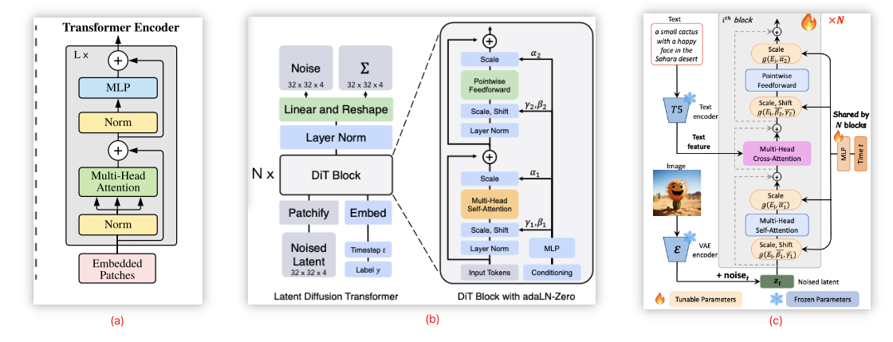
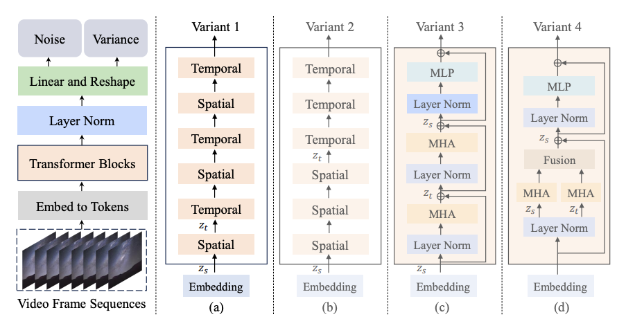
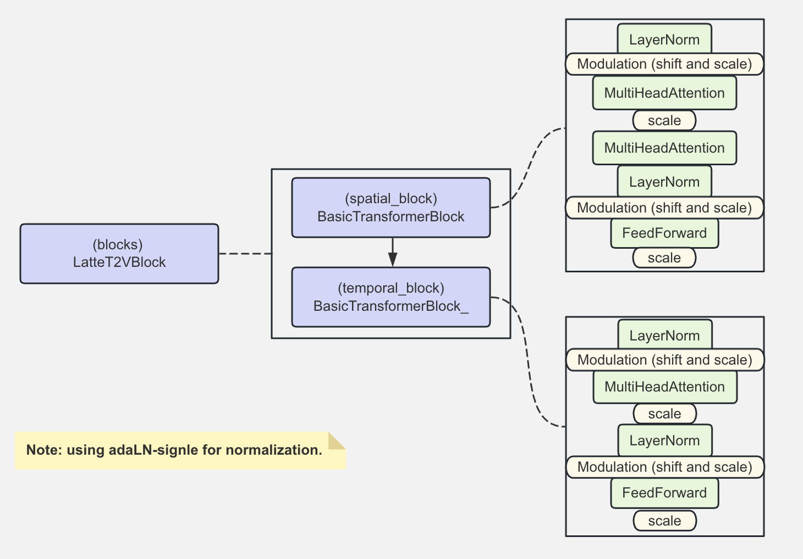

# Latte BasicTransformerBlock MindSpore 实现

本文介绍基于 Mindspore 在 Ascend 910* 上实现 Latte 网络中的单个 transformer block，主要代码参考自mindone套件[opensora-pku](https://github.com/mindspore-lab/mindone/tree/master/examples/opensora_pku/opensora/models/diffusion/latte)里的 Latte 实现。

## 1. 视觉类 transformer block 简介

Transformer 在自然语言处理（NLP）领域取得了巨大成功，[Vision Transformers (ViT)](https://arxiv.org/abs/2010.11929) 直接将Transformer架构应用于图像处理任务，开启了 transformer 架构在计算机视觉领域更广泛的应用。[Diffusion Transformers (DiT)](https://arxiv.org/abs/2212.09748) 架构基于 ViT，把 transformer 结构应用到扩散生成领域，并通过 adaptive layer norm（adaLN）, adaLN-Zero 等 设计使得模型的 transformer 块能有效利用条件信息。 PixArt-arpha 从降低训练成本的方向改进基于 transformer 的文生图扩散模型，改进点之一为 transformer block 使用 adaLN-single 降低参数量。上述 3 个模型的 transformer block 结构对比可参考下图。

<p align = "center">    

</p>
<p align="center">
  <em> the transformer block of (a) ViT, (b) DiT and (c) pixart-arpha </em>
</p>

Latte 为基于 transformer 骨干的隐空间视频扩散生成模型，视频数据对比图像数据多了时间维度特征。 Latte 针对骨干部分提出 4 种设计以提取视频的时间、空间特征。论文中的结构图如下，前两种变体类似，均使用单一的 transformer block 学时间与空间信息，即图中的 Spatial 与 Temporal 都是独立的 transformer block。后两种均修改 tranformer block 内部结构，多头注意力模块（MHA）先后处理空间时间，或各自处理空间时间再融合，即时空信息处理均在同一个 transformer block 内完成。下图来自 latte 原论文 4 种变体的结构图，其中一个橙色的 block 即为一个 transformer block。

<p align = "center">    

</p>
<p align="center">
  <em> latte 4 种变体，一个橙色块是一个 transformer block</em>
</p>

## 2. latte transformer block Mindspore 实现

OpenSora-PKU 的 latte 主要采用了上述第一种变体，空间、时间特征由单一的 transformer block 处理，顺序采用空间块、时间块交错设计。默认配置下，单个 transformer block 采用 PixArt-arpha 提出的 adaLN-single 作为归一化层，讲解参考讲解[自适应归一化层 MindSpore 实现](./latte_adalayernorm_implement.md)。

下图展示 OpenSora-PKU 的 Latte 默认配置下，空间 transformer block 与时间 transformer block 的具体结构，代码实现将按照图示结构实现。

<p align = "center">    

</p>
<p align="center">
  <em> OpenSora-PKU/latteT2V basic transformer blocks </em>
</p>

备注：TransformerBlocks 中的归一化层除了 `ada_norm_single` 还可以使用其他 如 'layer_norm', 'ada_norm', 'ada_norm_zero', 'ada_norm_single', mindone 仓完整版实现中可通过`norm_type` 控制，对应 block 内的计算也会有所调整。mindone 仓的 TransformerBlocks 还支持 [GLIGEN: Open-Set Grounded Text-to-Image Generation](https://arxiv.org/abs/2301.07093)方法, 通过 TransformerBlocks 初始化参数 `attention_type = gated` 打开，并在`construct` 的入参： `cross_attention_kwargs` 字典里的`gligen_kwargs["objs"]` 传递定位指令（生成图片/视频的附加信息），使得 GLIGEN Control 生效。

本文只展示了`norm_type="ada_norm_single"` 以及 `attention_type: str = "default"` 的实现。

### 2.1 spatial transformer block

空间 block : Norm + MultiHeadAttention + Norm + MultiHeadAttention + FeedFoward，其中第一个 MHA 为 self-attention，第二个 MHA 为 cross-attention，文本的 hidden_states 也参与计算。`construct` 的输入`timestep` 通过 adaLN-signle 归一化为模型注入时间戳条件。

与处理图像数据的 2d transformer block 不同，视频的 transformer block 两个 MHA 模块之前没有做 layernorm。

备注：归一化层、注意力机制层的实现讲解可分别参考 [自适应归一化层 MindSpore 实现](./latte_adalayernorm_implement.md), [Latte 多头注意力模块 MindSpore 实现](./latte_mha_implement.md)。 


```python
from typing import Any, Dict, Optional
import mindspore as ms
from mindspore import nn, ops

# clone mindone, cd examples/opensora_pku
from opensora.models.diffusion.latte.modules import LayerNorm, MultiHeadAttention, FeedForward

class BasicTransformerBlock(nn.Cell):
    r"""
    A basic Transformer block. for spatial_block
    """

    def __init__(
        self,
        dim: int,
        num_attention_heads: int,
        attention_head_dim: int,
        dropout=0.0,
        cross_attention_dim: Optional[int] = None,
        activation_fn: str = "geglu",
        attention_bias: bool = False,
        only_cross_attention: bool = False,
        double_self_attention: bool = False,
        upcast_attention: bool = False,
        norm_elementwise_affine: bool = True,
        norm_type: str = "ada_norm_single",  # 'ada_norm', 'ada_norm_zero', 'ada_norm_single'
        norm_eps: float = 1e-5,
        final_dropout: bool = False,
        attention_type: str = "default", #  "default", "gated", "gated-text-image"
        enable_flash_attention: bool = False,
    ):
        super().__init__()
        self.only_cross_attention = only_cross_attention

        self.use_ada_layer_norm_single = norm_type == "ada_norm_single"
        assert self.use_ada_layer_norm_single, "NotImplementedError: please refer to the mindone OpenSora-PKU repo"

        self.norm1_ln = LayerNorm(dim, elementwise_affine=norm_elementwise_affine, eps=norm_eps)

        # 1. Self-Attn
        self.attn1 = MultiHeadAttention(
            query_dim=dim,
            heads=num_attention_heads,
            dim_head=attention_head_dim,
            dropout=dropout,
            bias=attention_bias,
            cross_attention_dim=cross_attention_dim if only_cross_attention else None,
            upcast_attention=upcast_attention,
            enable_flash_attention=enable_flash_attention,
        )

        # 2. Cross-Attn
        if cross_attention_dim is not None or double_self_attention:
            self.norm2_ln = LayerNorm(dim, elementwise_affine=norm_elementwise_affine, eps=norm_eps)
            self.attn2 = MultiHeadAttention(
                query_dim=dim,
                cross_attention_dim=cross_attention_dim if not double_self_attention else None,
                heads=num_attention_heads,
                dim_head=attention_head_dim,
                dropout=dropout,
                bias=attention_bias,
                upcast_attention=upcast_attention,
                enable_flash_attention=enable_flash_attention,
            )  # is self-attn if encoder_hidden_states is none
        else:
            self.norm2 = None
            self.attn2 = None

        # 3. Feed-forward
        self.norm3 = LayerNorm(dim, elementwise_affine=norm_elementwise_affine, eps=norm_eps)
        self.ff = FeedForward(
            dim,
            dropout=dropout,
            activation_fn=activation_fn,
            final_dropout=final_dropout,
        )

        # Scale-shift for PixArt-Alpha.
        if self.use_ada_layer_norm_single:
            self.scale_shift_table = ms.Parameter(ops.randn(6, dim) / dim**0.5)

        # let chunk size default to None
        self._chunk_size = None
        self._chunk_dim = 0

    def construct(
        self,
        hidden_states: ms.Tensor,
        attention_mask: Optional[ms.Tensor] = None,
        encoder_hidden_states: Optional[ms.Tensor] = None,
        encoder_attention_mask: Optional[ms.Tensor] = None,
        timestep: Optional[ms.Tensor] = None, 
        cross_attention_kwargs: Dict[str, Any] = None,
        class_labels: Optional[ms.Tensor] = None,
    ) -> ms.Tensor:
        
        # 1. Retrieve lora scale.
        lora_scale = cross_attention_kwargs.get("scale", 1.0) if cross_attention_kwargs is not None else 1.0
        
        # Notice that normalization is always applied before the real computation in the following blocks.
        batch_size = hidden_states.shape[0]
        gate_msa, shift_mlp, scale_mlp, gate_mlp = None, None, None, None

        shift_msa, scale_msa, gate_msa, shift_mlp, scale_mlp, gate_mlp = (
            self.scale_shift_table[None] + timestep.reshape(batch_size, 6, -1)
        ).chunk(6, axis=1)
        norm_hidden_states = self.norm1_ln(hidden_states)
        norm_hidden_states = norm_hidden_states * (1 + scale_msa) + shift_msa
            
        # 2. self-Attention
        attn_output = self.attn1(
            norm_hidden_states,
            encoder_hidden_states=encoder_hidden_states if self.only_cross_attention else None,
            attention_mask=attention_mask,
            **cross_attention_kwargs,
        )
        
        attn_output = gate_msa * attn_output
        hidden_states = attn_output + hidden_states
        if hidden_states.ndim == 4:
            hidden_states = hidden_states.squeeze(1)

        # 3. Cross-Attention
        if self.attn2 is not None:

            # norm_hidden_states = self.norm2_ln(hidden_states)
            # use_ada_layer_norm_single, for PixArt norm2 isn't applied here
            norm_hidden_states = hidden_states

            attn_output = self.attn2(
                norm_hidden_states,
                encoder_hidden_states=encoder_hidden_states,
                attention_mask=encoder_attention_mask,
                **cross_attention_kwargs,
            )
            hidden_states = attn_output + hidden_states

        # 4. Feed-forward
        # use_ada_layer_norm_single
        norm_hidden_states = self.norm2_ln(hidden_states)
        norm_hidden_states = norm_hidden_states * (1 + scale_mlp) + shift_mlp

        ff_output = self.ff(norm_hidden_states, scale=lora_scale)

        # use_ada_layer_norm_single
        ff_output = gate_mlp * ff_output

        hidden_states = ff_output + hidden_states
        if hidden_states.ndim == 4:
            hidden_states = hidden_states.squeeze(1)

        return hidden_states
```

### 2.2 temporal transformer block

时间 transformer block : Norm + MultiHeadAttention + Norm + FeedFoward。 相比空间 transformer block 少了第二个 MHA， 只用了 self-attention 。


```python
class BasicTransformerBlock_(nn.Cell):
    r"""
    A basic Transformer block. for temporal_block

    """

    def __init__(
        self,
        dim: int,
        num_attention_heads: int,
        attention_head_dim: int,
        dropout=0.0,
        cross_attention_dim: Optional[int] = None,
        activation_fn: str = "geglu",
        attention_bias: bool = False,
        only_cross_attention: bool = False,
        double_self_attention: bool = False,
        upcast_attention: bool = False,
        norm_elementwise_affine: bool = True,
        norm_type: str = "ada_norm_single",  # 'layer_norm', 'ada_norm', 'ada_norm_zero', 'ada_norm_single'
        norm_eps: float = 1e-5,
        final_dropout: bool = False,
        attention_type: str = "default", #  "default", "gated", "gated-text-image"
        enable_flash_attention: bool = False,
    ):
        super().__init__()
        self.only_cross_attention = only_cross_attention

        self.use_ada_layer_norm_single = norm_type == "ada_norm_single"
        assert self.use_ada_layer_norm_single, "NotImplementedError: please refer to the mindone OpenSora-PKU repo"
        self.norm1_ln = LayerNorm(dim, elementwise_affine=norm_elementwise_affine, eps=norm_eps)

        self.attn1 = MultiHeadAttention(
            query_dim=dim,
            heads=num_attention_heads,
            dim_head=attention_head_dim,
            dropout=dropout,
            bias=attention_bias,
            cross_attention_dim=cross_attention_dim if only_cross_attention else None,
            upcast_attention=upcast_attention,
            enable_flash_attention=enable_flash_attention,
        )

        self.norm3 = LayerNorm(dim, elementwise_affine=norm_elementwise_affine, eps=norm_eps)

        self.ff = FeedForward(dim, dropout=dropout, activation_fn=activation_fn, final_dropout=final_dropout)

        # Scale-shift for PixArt-Alpha.
        if self.use_ada_layer_norm_single:
            self.scale_shift_table = ms.Parameter(ops.randn(6, dim) / dim**0.5)
            
        # let chunk size default to None
        self._chunk_size = None
        self._chunk_dim = 0

    def construct(
        self,
        hidden_states: ms.Tensor,
        attention_mask: Optional[ms.Tensor] = None,
        encoder_hidden_states: Optional[ms.Tensor] = None,
        encoder_attention_mask: Optional[ms.Tensor] = None,
        timestep: Optional[ms.Tensor] = None,
        cross_attention_kwargs: Dict[str, Any] = None,
        class_labels: Optional[ms.Tensor] = None,
    ) -> ms.Tensor:

        # 1. Retrieve lora scale.
        lora_scale = cross_attention_kwargs.get("scale", 1.0) if cross_attention_kwargs is not None else 1.0

        # Notice that normalization is always applied before the real computation in the following blocks.
        batch_size = hidden_states.shape[0]
        gate_msa, shift_mlp, scale_mlp, gate_mlp = None, None, None, None

        shift_msa, scale_msa, gate_msa, shift_mlp, scale_mlp, gate_mlp = (
            self.scale_shift_table[None] + timestep.reshape(batch_size, 6, -1)
        ).chunk(6, axis=1)
        norm_hidden_states = self.norm1_ln(hidden_states)
        norm_hidden_states = norm_hidden_states * (1 + scale_msa) + shift_msa

        # 2. Self-Attention
        norm_hidden_states = self.norm1_ln(hidden_states)
        attn_output = self.attn1(
            norm_hidden_states,
            encoder_hidden_states=encoder_hidden_states if self.only_cross_attention else None,
            attention_mask=attention_mask,
            **cross_attention_kwargs,
        )
        attn_output = gate_msa * attn_output

        hidden_states = attn_output + hidden_states
        if hidden_states.ndim == 4:
            hidden_states = hidden_states.squeeze(1)

        # 3. Feed-forward
        #use_ada_layer_norm_single:
        norm_hidden_states = self.norm3(hidden_states)
        norm_hidden_states = norm_hidden_states * (1 + scale_mlp) + shift_mlp

        ff_output = self.ff(norm_hidden_states, scale=lora_scale)

        #use_ada_layer_norm_single:
        ff_output = gate_mlp * ff_output

        hidden_states = ff_output + hidden_states
        if hidden_states.ndim == 4:
            hidden_states = hidden_states.squeeze(1)

        return hidden_states
```

## 3. 扩展阅读

本文介绍了 Latte 网络中的单个 transformer block 的 MindSpore 实现。

`LatteT2V` 完整 MindSpore 实现代码可参考 `mindone` 仓： [examples/opensora_pku/opensora/models/diffusion/latte](https://github.com/mindspore-lab/mindone/tree/master/examples/opensora_pku/opensora/models/diffusion/latte)


`mindone` 套件仓已兼容 diffusers 库， 图片、视频生成扩散模型更一般的 2d、3d transformer block 实现，SD3-mmdit 使用的 joint transformer block 实现等可参考: [`mindone/diffusers/models/attention.py`](https://github.com/mindspore-lab/mindone/blob/master/mindone/diffusers/models/attention.py)

论文阅读：

- ViT: [An Image is Worth 16x16 Words: Transformers for Image Recognition at Scale](https://arxiv.org/abs/2010.11929)
- DiT: [Scalable Diffusion Models with Transformers](https://arxiv.org/abs/2212.09748)
- PIXART-α: [Fast Training of Diffusion Transformer for Photorealistic Text-to-Image Synthesis](https://arxiv.org/abs/2310.00426)
- Latte: [Latent Diffusion Transformer for Video Generation](https://arxiv.org/abs/2401.03048)
