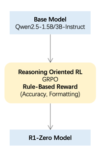
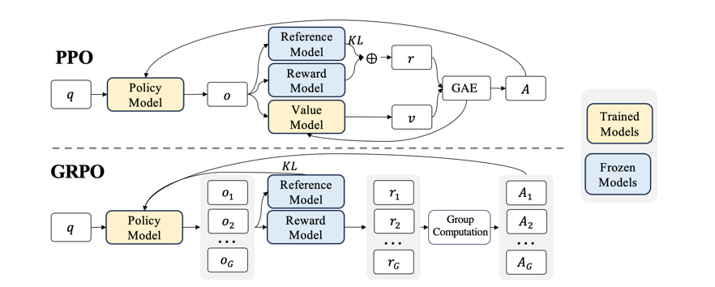
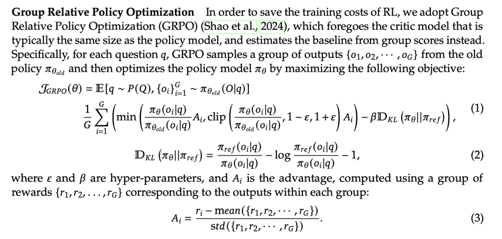

# 从零复现一个小型的 R1-Zero


## 目录

- [DeepSeek R1 Zero 介绍]()
- [RL方法 - GRPO]()
- [奖励建模 (Reward Modeling)]()
- [训练模版提示 (Training Template)]()
- [创建数据集]()
- [在一个简单任务中训练 - Countdown Task]()
- [在你的环境运行](../README.md)


## 1. DeepSeek R1 Zero 介绍

**DeepSeek R1 Zero** (后简称 R1-Zero) 是通过纯强化学习进行训练的，使用了 **GRPO, Group Relative Policy Optimization** 强化学习算法， 
设计了带有特定思考格式的训练模版提示， 并应用了 **准确率奖励(Accuracy rewards)** 以及 **格式奖励(Format rewards)** 进行训练。




## 2. RL方法 - GRPO
**GRPO** 算法中使用了 **组相对奖励(Group Relative Rewards)** 替换 **PPO** 算法中的 **Value Model** 和 **GAE** 用于 **优势函数计算(Advantage)**，节省显存并使得算法更加简洁。

算法结构图如下：



优化过程如下：



MindSpore代码实现如下：

[源码位置](../src/grpo.py)

```python
import numpy as np
from typing import Callable, Optional, List
from transformers import PreTrainedTokenizer, GenerationConfig

import mindspore as ms
from mindspore import nn, ops, Tensor

class GRPO(nn.Cell):
    def __init__(
            self,
            policy_model: Optional[nn.Cell],
            reference_model: Optional[nn.Cell],
            reward_funcs: List[Callable],
            tokenizer: PreTrainedTokenizer,
            args
    ):
        super(GRPO, self).__init__()

        self.policy_model = policy_model
        self.reference_model = reference_model
        self.reward_funcs = reward_funcs
        self.tokenizer = tokenizer

        # Training arguments
        self.max_completion_length = args.max_completion_length  # = |o_i| in the GRPO paper
        self.num_generations = args.num_generations              # = G in the GRPO paper
        self.beta = args.beta

        self.generation_config = GenerationConfig(
            max_new_tokens=args.max_completion_length,
            do_sample=True,
            temperature=args.temperature,
            num_return_sequences=args.num_generations,
            pad_token_id=tokenizer.pad_token_id,
        )

    def get_completion_and_reward(self, batch):
        prompts, nums, targets, prompt_ids, attention_mask = \
            batch["prompts"], batch["nums"], batch["targets"], batch["prompt_ids"], batch["attention_mask"]
        prompts = np.array(prompts).tolist()
        nums = [np.array(b).tolist() for b in batch["nums"]]

        # FIXME: unpad
        assert prompt_ids.shape[0] == 1, "not support bs>1 when generate task"
        prompt_ids = prompt_ids[:, :attention_mask.sum()]
        attention_mask = attention_mask[:, :attention_mask.sum()]

        completion_ids = self.policy_model.generate(
            input_ids=Tensor(prompt_ids, ms.int32),
            attention_mask=Tensor(attention_mask, ms.bool_),
            generation_config=self.generation_config,
            max_new_tokens=self.max_completion_length,
            use_cache=False,
        )
        completion_ids = completion_ids.asnumpy()
        prompt_completion_ids = np.concatenate([prompt_ids.repeat(self.num_generations, axis=0), completion_ids], axis=-1)
        num_logits_to_keep = completion_ids.shape[1]

        # Mask everything after the first EOS token
        is_eos = np.array(completion_ids == self.tokenizer.eos_token_id)
        eos_idx = np.full((is_eos.shape[0],), is_eos.shape[1], dtype=np.int)
        eos_idx[is_eos.any(axis=1)] = is_eos.astype(np.int).argmax(axis=1)[is_eos.any(axis=1)]
        sequence_indices = np.arange(is_eos.shape[1])[None].repeat(is_eos.shape[0], axis=0)
        completion_mask = (sequence_indices <= eos_idx[:, None]).astype(np.int)

        # get reward
        # decode the generated completions
        completions = self.tokenizer.batch_decode(completion_ids, skip_special_tokens=True)
        prompts = [prompt for prompt in prompts for _ in range(self.num_generations)]

        rewards_per_func = np.zeros((len(prompts), len(self.reward_funcs)), dtype=np.float32)
        for i, reward_func in enumerate(self.reward_funcs):
            rewards_per_func[:, i] = reward_func(completions=completions, nums=nums, targets=targets, prompt=prompts)  # Shape (B*G,)
        rewards = rewards_per_func.sum(axis=1)

        return prompt_completion_ids, num_logits_to_keep, completion_mask, rewards

    def compute_loss(
            self,
            prompt_completion_ids: Tensor,
            num_logits_to_keep: int,
            completion_mask: Tensor,
            rewards: Tensor
    ) -> Tensor:

        # 1. compute grpo reward and advantages
        mean_grouped_rewards = rewards.view(-1, self.num_generations).mean(axis=1)
        std_grouped_rewards = rewards.view(-1, self.num_generations).std(axis=1)

        # normalize the rewards to compute the advantages
        mean_grouped_rewards = mean_grouped_rewards.repeat_interleave(self.num_generations, dim=0)
        std_grouped_rewards = std_grouped_rewards.repeat_interleave(self.num_generations, dim=0)
        advantages = (rewards - mean_grouped_rewards) / (std_grouped_rewards + 1e-4)

        # 2. compute kl divergence
        per_token_logps = self.get_log_probabilities(
            prompt_completion_ids,
            self.policy_model(prompt_completion_ids)[0],
            num_logits_to_keep,
        )
        ref_per_token_logps = self.get_log_probabilities(
            prompt_completion_ids,
            self.reference_model(prompt_completion_ids)[0],
            num_logits_to_keep,
        )
        kl_divergence = ops.exp(ref_per_token_logps - per_token_logps) - (ref_per_token_logps - per_token_logps) - 1

        # x - x.detach() allows for preserving gradients from x
        per_token_loss = ops.exp(per_token_logps - ops.stop_gradient(per_token_logps)) * advantages.unsqueeze(1)
        per_token_loss = -(per_token_loss - self.beta * kl_divergence)
        loss = ((per_token_loss * completion_mask).sum(axis=1) / completion_mask.sum(axis=1)).mean()

        return loss

    def get_log_probabilities(self, input_ids: Tensor, logits: Tensor, num_logits_to_keep: int) -> Tensor:
        # logits: (B, L, V), prompt_completion_logits -> completion_logits
        logits = logits[:, -(num_logits_to_keep+1):-1, :]

        # Compute the log probabilities for the input tokens. Use a loop to reduce memory peak.
        per_token_logps = ()

        for i in range(logits.shape[0]):
            logits_row, input_ids_row = logits[i], input_ids[i, -num_logits_to_keep:]

            log_probs = ops.log_softmax(logits_row, axis=-1)
            token_log_prob = ops.gather_elements(log_probs, dim=1, index=input_ids_row.unsqueeze(1)).squeeze(1)
            per_token_logps += (token_log_prob,)

        return ops.stack(per_token_logps)
```


## 3. 奖励建模 (Reward Modeling)

**R1-Zero** 中使用了 **格式奖励(Format rewards)** 以及 **准确率奖励(Accuracy rewards)** 进行训练，代码如下：

[源码位置](../src/rewards.py)

**格式奖励(Format rewards):**

```python
import re
import numpy as np

def format_reward(completions: list[str], *args, **kwargs) -> np.ndarray:
    """Reward function that checks if the completion has a specific format."""
    pattern = r"^<think>.*?</think>\s*<answer>.*?</answer>$"
    # add synthetic <think> as its already part of the prompt and prefilled for the assistant to more easily match the regex
    matches = [re.match(pattern, "<think>" + content, re.DOTALL | re.MULTILINE) for content in completions]
    return np.array([1.0 if match else 0.0 for match in matches])
```

**准确率奖励(Accuracy rewards):**

> 这里以 **Countdown Game** 作为例子

```python
import re
import numpy as np

def countdown_game_accuracy_reward(completions: list[str], nums: int, targets: int, *args, **kwargs) -> np.ndarray:
    """
    For Countdown Game, evaluates completions based on: Mathematical correctness of the answer

    Args:
        completions (list[str]): Generated outputs
        targets (int): Expected answers
        nums (int): Available numbers

    Returns:
        list[float]: Reward scores
    """
    rewards = []
    for completion, gt, numbers in zip(completions, targets, nums):
        try:
            # Check if the format is correct
            match = re.search(r"<answer>(.*?)<\/answer>", completion)
            if match is None:
                rewards.append(0.0)
                continue
            # Extract the "answer" part from the completion
            equation = match.group(1).strip()
            # Extract all numbers from the equation
            used_numbers = [int(n) for n in re.findall(r'\d+', equation)]

            # Check if all numbers are used exactly once
            if sorted(used_numbers) != sorted(numbers):
                rewards.append(0.0)
                continue
            # Define a regex pattern that only allows numbers, operators, parentheses, and whitespace
            allowed_pattern = r'^[\d+\-*/().\s]+$'
            if not re.match(allowed_pattern, equation):
                rewards.append(0.0)
                continue

            # Evaluate the equation with restricted globals and locals
            result = eval(equation, {"__builti'ns__": None}, {})
            # Check if the equation is correct and matches the ground truth
            if abs(float(result) - float(gt)) < 1e-5:
                rewards.append(1.0)
            else:
                rewards.append(0.0)
        except Exception:
            # If evaluation fails, reward is 0
            rewards.append(0.0)
    return np.array(rewards)
```


## 4. 训练模版提示 (Training Template)

**R1-Zero** 论文中的训练模版提示：

```text
A conversation between User and Assistant. The user asks a question, and the Assistant solves it. The assistant first thinks about the reasoning process in the mind and then provides the user with the answer. The reasoning process and answer are enclosed within <think> </think> and <answer> </answer> tags, respectively, i.e., <think> reasoning process here </think>
<answer> answer here </answer>. User: prompt. Assistant:
```

以 **Countdown Game** 为例子，代码如下：

[源码位置](../src/dataset.py:22)

```python
def generate_r1_prompt(numbers, target):
    r1_prefix = [{
        "role": "system",
        "content": "You are a helpful assistant. You first thinks about the reasoning process in the mind and then provides the user with the answer."
    },
        {
            "role": "user",
            "content": f"Using the numbers {numbers}, create an equation that equals {target}. You can use basic arithmetic operations (+, -, *, /) and each number can only be used once. Show your work in <think> </think> tags. And return the final equation and answer in <answer> </answer> tags, for example <answer> (1 + 2) / 3 = 1 </answer>."
        },
        {
            "role": "assistant",
            "content": "Let me solve this step by step.\n<think>"
        }]
    return {"prompt": tokenizer.apply_chat_template(r1_prefix, tokenize=False, continue_final_message=True),
            "target": target}
```


## 5. 创建一个 **Countdown Task** 数据集，并使用`mindspore.dataset`接口进行封装

[原始数据集格式](https://huggingface.co/datasets/Jiayi-Pan/Countdown-Tasks-3to4)

[源码位置](../src/dataset.py)

```python
import numpy as np

from transformers import PreTrainedTokenizer
from datasets import load_dataset
from mindone.transformers.mindspore_adapter.data import HF2MSDataset
import mindspore


def create_countdown_dataset(
        hf_dataset_path: str = "Jiayi-Pan/Countdown-Tasks-3to4",
        tokenizer: PreTrainedTokenizer = None,
        batch_size: int = 1,
        num_epochs: int = 1,
        rank: int = 0,
        rank_size: int = 1,
):

    # generate r1 prompt with a prefix for the model to already start with the thinking process

    # TODO: remove <think>
    def generate_r1_prompt(numbers, target):
        r1_prefix = [{
            "role": "system",
            "content": "You are a helpful assistant. You first thinks about the reasoning process in the mind and then provides the user with the answer."
        },
            {
                "role": "user",
                "content": f"Using the numbers {numbers}, create an equation that equals {target}. You can use basic arithmetic operations (+, -, *, /) and each number can only be used once. Show your work in <think> </think> tags. And return the final equation and answer in <answer> </answer> tags, for example <answer> (1 + 2) / 3 = 1 </answer>."
            },
            {
                "role": "assistant",
                "content": "Let me solve this step by step.\n<think>"
            }]
        return {"prompt": tokenizer.apply_chat_template(r1_prefix, tokenize=False, continue_final_message=True),
                "target": target}

    # Load dataset from Hugging Face Hub
    dataset = load_dataset(hf_dataset_path, split="train")
    # select a random subset of 50k samples
    dataset = dataset.shuffle(seed=42).select(range(50000))

    # convert our dataset to the r1 prompt
    dataset = dataset.map(lambda x: generate_r1_prompt(x["nums"], x["target"]))

    # split the dataset into train and test
    train_test_split = dataset.train_test_split(test_size=0.1)
    train_dataset = train_test_split["train"]
    test_dataset = train_test_split["test"]

    # convert hf-datasets to mindspore-dataset

    def ms_data_collator(inputs, batch_info):
        first = inputs[0]
        assert isinstance(first, dict)
        prompts = [x["prompt"] for x in inputs]
        nums = [x["nums"] for x in inputs]
        targets = np.array([int(x["target"]) for x in inputs])
        # prompt_inputs = tokenizer(prompts, return_tensors="np", padding=True, padding_side="left", add_special_tokens=False)
        prompt_inputs = tokenizer(
            prompts,
            return_tensors="np",
            padding="max_length",
            truncation=True,
            max_length=256,
            padding_side="right",
            add_special_tokens=False
        )
        batch = {
            "prompts": prompts,
            "nums": nums,
            "targets": targets,
            "prompt_ids": prompt_inputs.input_ids,
            "attention_mask": prompt_inputs.attention_mask,
        }
        return batch

    ms_train_dataset = mindspore.dataset.GeneratorDataset(
        HF2MSDataset(train_dataset), column_names="item", shard_id=rank, num_shards=rank_size
    )
    ms_train_dataset = ms_train_dataset.batch(batch_size=batch_size, per_batch_map=ms_data_collator)
    ms_train_dataset = ms_train_dataset.repeat(1)
    ms_train_dataset = ms_train_dataset.create_dict_iterator(num_epochs=num_epochs, output_numpy=True)

    ms_test_dataset = mindspore.dataset.GeneratorDataset(
        HF2MSDataset(test_dataset), column_names="item", shard_id=rank, num_shards=rank_size
    )
    ms_test_dataset = ms_test_dataset.batch(batch_size=1, per_batch_map=ms_data_collator)
    ms_test_dataset = ms_test_dataset.repeat(1)
    ms_test_dataset = ms_test_dataset.create_dict_iterator(num_epochs=1, output_numpy=True)

    return ms_train_dataset, ms_test_dataset
```


## 6. 在一个简单任务中训练 - Countdown Task

[Countdown Task](https://huggingface.co/datasets/Jiayi-Pan/Countdown-Tasks-3to4)

[源码位置](../train_r1_zero.py)

### Step 1：创建数据集

```python
from transformers import AutoTokenizer

tokenizer = AutoTokenizer.from_pretrained("Qwen/Qwen2.5-1.5B-Instruct")
tokenizer.pad_token = tokenizer.eos_token

train_dataset, test_dataset = create_countdown_dataset("Jiayi-Pan/Countdown-Tasks-3to4", tokenizer=tokenizer)
```

### Step 2：创建模型

> 这里使用 **Qwen2.5-1.5B-Instruct** 模型

```python
import mindspore
from mindone.transformers import Qwen2ForCausalLM

policy_model = Qwen2ForCausalLM.from_pretrained(
    "Qwen/Qwen2.5-1.5B-Instruct",
    mindspore_dtype=mindspore.bfloat16,
    return_dict=False,
)
reference_model = Qwen2ForCausalLM.from_pretrained(
    "Qwen/Qwen2.5-1.5B-Instruct",
    mindspore_dtype=mindspore.bfloat16,
    return_dict=False,
)

grpo_model = GRPO(policy_model, reference_model, [format_reward, countdown_game_accuracy_reward], tokenizer, args)
```

### Step 3：创建优化器和MindSpore训练模型

```python
class TrainNet(nn.Cell):
    def __init__(self, grpo_model: GRPO):
        super(TrainNet, self).__init__(auto_prefix=False)
        self.grpo_model = grpo_model

    def construct(self, *args, **kwargs):
        loss = self.grpo_model.compute_loss(*args, **kwargs)
        return loss

optimizer = nn.AdamWeightDecay(policy_model.trainable_params(), learning_rate=5e-7)
train_model = TrainOneStepWrapper(TrainNet(grpo_model), optimizer)
```

### Step 4：启动训练

```python
train_model.set_train()
for step, batch in enumerate(train_dataset):
    batch = batch["item"]
    prompt_completion_ids, num_logits_to_keep, completion_mask, rewards = \
        grpo_model.get_completion_and_reward(batch)

    loss, _, overflow = train_model(
        mindspore.Tensor(prompt_completion_ids, mindspore.int32),
        num_logits_to_keep,
        mindspore.Tensor(completion_mask, mindspore.bool_),
        mindspore.Tensor(rewards, mindspore.float32),
    )

    print(f"step: {step}, loss: {loss}")
```


## 6. 在你的环境运行

参考 [Mini-R1-Zero 示例代码 README](../README.md)
