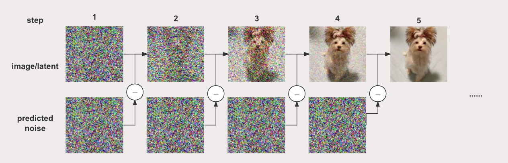

# SD 采样器实现——Euler Sampler



## 1. sampling concepts

文生图扩散模型的训练（扩散过程的前向）从0到T步往干净的图片逐步加噪直到接近高斯分布的纯噪声；推理（扩散过程的反向）则是从T到0对高斯随机噪声去噪，得到来自近似于真实数据分布的图像。当前已有大量工作对推理过程中的采样器算法做了加速，使得去噪的步数可以远小于T。

sampling（去噪过程）有以下常见概念：
* sampler：采样器，指的是sampling使用的方法
* noise level：噪声水平（或者噪声强度），可以简单理解成高斯分布的方差 $\sigma$ (代码中经常看到的sigma)。假设推理步数设为N，噪声水平在开始最高，到第N步降至0，$\sigma_0 = \sigma_{max} > \sigma_1 ... > \sigma_N = 0$ 。
* noise schedule：噪声调度器，定义了去噪的有效时间戳、并控制每个采样步骤的噪声水平 $\sigma$ 。采样器根据调度器中对应某个步骤的噪声强度，减去该步的模型预测的噪声，从而产生该步去噪后的图像。

默认情况下，采样器每一步处理中以固定的比例减少噪声，Karras系列采样器算法则在最后的步数中去噪强度变小，这有助于提高图像生成质量。


## 2. Euler sampler implement from scratch

采样器实现可以简单分为3个部分：
* the noise schedule：噪声调度器准 - 包括计算采样步数对应的时间戳、对应的噪声水平
* a single sample step： 单步求解的实现 - 根据上一步去噪图像、模型预测的图片在当前时间戳的噪声，求解得到当前步去噪后的图像（或latent）；Euler采样器使用Euler离散一阶数值解法。
* the loop：迭代求解的循环 - 迭代多次单步求解得到干净图像（或latent），步数由参数`num_inference_step`设定

本文将逐一展开细节，基于Mindspore从头构建一个完整的Euler采样器。

### 2.1 helper function
我们先import需要用到的库，以及定义好后面需要用到的helper函数。Mindspore设置全局动态图模式可方便调试。


```python
from typing import Dict, Union
import mindspore as ms
from mindspore import context, Tensor, nn, ops
import numpy as np
from tqdm import tqdm
import importlib
from inspect import isfunction

context.set_context(mode=context.PYNATIVE_MODE)
```


```python
# helper functions
def append_dims(x: ms.Tensor, target_dims: int):
    """Appends dimensions to the end of a tensor until it has target_dims dimensions."""
    dims_to_append = target_dims - x.ndim
    if dims_to_append < 0:
        raise ValueError(f"input has {x.ndim} dims but target_dims is {target_dims}, which is less")
    for i in range(dims_to_append):
        x = x[..., None]
    return x


def append_zero(x):
    return np.concatenate([x, np.zeros([1], dtype=x.dtype)])


def default(val, d):
    if val is not None:
        return val
    return d() if isfunction(d) else d
```

### 2.2 the noise schedule
该小节实现控制降噪过程的调度器：生成降噪的有效时间戳序列（此案例了使用离散而非连续的时间戳），时间戳对应的噪声水平相关参数，如$\beta, \sigma$。

首先，设定扩散前向的步数为1000，扩散反向推理步数为40。定义参数`beta`, `alpha`, `alphas_cumprod`在扩散过程1000步中分别对应的值， 这些参数将用于计算每一步对应的噪声水平`sigma`。


```python
num_train_steps = 1000
num_inference_steps = 40

# beta schedule: "scaled_linear"
linear_start = 1e-4
linear_end = 2e-2
betas = np.linspace(linear_start**0.5, linear_end**0.5, num_train_steps, dtype=np.float32) ** 2

alphas = 1.0 - betas
alphas_cumprod = np.cumprod(alphas, axis=0)
```

在1000步中等长地挑选40个推理时间戳作为有效的去噪时间戳，其他时间戳就跳过不算了。计算时间戳对应的噪声水平`sigma`，后续作为采样器算法每一步迭代的输入。


```python
assert num_inference_steps < num_train_steps
timesteps = np.linspace(num_train_steps - 1, 0, num_inference_steps, endpoint=False).astype(int)[::-1]
print("从1000步中等长地选40个降噪用的时间戳：\n", timesteps)
```

    从1000步中等长地选40个降噪用的时间戳：
     [ 24  49  74  99 124 149 174 199 224 249 274 299 324 349 374 399 424 449
     474 499 524 549 574 599 624 649 674 699 724 749 774 799 824 849 874 899
     924 949 974 999]


计算有效时间戳对应的噪声水平，得到`sigams`列表。


```python
alphas_cumprod = alphas_cumprod[timesteps]
sigmas = ((1 - alphas_cumprod) / alphas_cumprod) ** 0.5
sigmas =  np.flip(sigmas, (0,))

print("调度器推理时对应每一步的噪声水平：\n", sigmas)
```

    调度器推理时对应每一步的噪声水平：
     [36.91191    28.829996   22.777088   18.196123   14.693674   11.989132
      9.880423    8.220672    6.902157    5.845183    4.9902925   4.292765
      3.718697    3.2421978   2.8433478   2.506718    2.220275    1.9745748
      1.7621597   1.577105    1.4146767   1.2710724   1.1432222   1.0286354
      0.92528194  0.8315017   0.7459322   0.66745275  0.59513956  0.52823246
      0.46610525  0.4082444   0.35423154  0.3037262   0.2564504   0.21217072
      0.17066702  0.13167056  0.09467557  0.0581383 ]


我们可以把上述流程封装成`LegacyDDPMDiscretization`类，定义采样器需要的schedule：
1. 类的初始化定义了参数`beta`, `alpha`, `alphas_cumprod`
2. `get_sigmas`函数用于计算去噪过程的噪声水平列表。
3. `__call__`函数，类实例化后可当函数调用。

*tips：在mindone/example/stable_diffusion_xl的实现中，这部分在/gm/modules/diffusionmodules/discretizer.py*

```python
def make_beta_schedule(
    schedule,
    n_timestep,
    linear_start=1e-4,
    linear_end=2e-2,
):
    if schedule == "scaled_linear":
        betas = np.linspace(linear_start**0.5, linear_end**0.5, n_timestep, dtype=np.float32) ** 2
    elif schedule == "linear":
        betas = np.linspace(linear_start, linear_end, n_timestep, dtype=np.float32)
    else:
        raise NotImplementedError
    return betas


class LegacyDDPMDiscretization:
    def __init__(
        self,
        linear_start=0.00085,
        linear_end=0.0120,
        num_train_timesteps=1000,
        beta_schedule='scaled_linear',
    ):
        super().__init__()
        betas = make_beta_schedule(beta_schedule, 
                                   num_train_timesteps, 
                                   linear_start=linear_start, 
                                   linear_end=linear_end)
        alphas = 1.0 - betas
        self.alphas_cumprod = np.cumprod(alphas, axis=0)
        self.num_train_timesteps = num_train_timesteps

    def get_sigmas(self, num_inference_steps):
        if num_inference_steps < self.num_train_timesteps:
            timesteps = np.linspace(self.num_train_timesteps - 1, 0, num_inference_steps, endpoint=False).astype(int)[::-1]
            alphas_cumprod = self.alphas_cumprod[timesteps]
        elif num_inference_steps == self.num_train_timesteps:
            alphas_cumprod = self.alphas_cumprod
            self.timesteps = np.linspace(0, self.num_train_timesteps).astype(int)
        else:
            raise ValueError
        
        sigmas = ((1 - alphas_cumprod) / alphas_cumprod) ** 0.5
        return np.flip(sigmas, (0,))
        
    def __call__(self, num_inference_steps, do_append_zero=True, flip=False):
        sigmas = self.get_sigmas(num_inference_steps)

        # 是否在sigma列表最后补0
        if do_append_zero:
            sigmas = np.concatenate([sigmas, np.zeros([1], dtype=sigmas.dtype)])
        
        # 是否反转sigma列表
        if flip:
            sigmas = np.flip(sigmas, (0,))

        return sigmas
```

### 2.3 a single sample step

采样加速的研究工作之一是：引入SDE框架描述扩散模型，并证明每个扩散模型都有对应的确定性ODE形式使得其边缘分布与SDE一致，从而可以借助ODE求解器加速采样。欧拉法是经典的求解常微分方程的一阶离散数值方法，其思想为把函数离散化，分割成一段段递归求近似解：

$$
x(t+\triangle t) \approx x(t) + f(x(t), t)\triangle t
$$

简单对应到扩散过程，把上述的公式中的变量t对应到噪声水平 $\sigma_t$ ， $x$ 对应到图像表示，则：
* $x(\sigma_{t+1})=x(\sigma_t+\triangle\sigma)$ ：下一步噪声水平$\sigma_{t+1}$下的图像表示
* $f(x(\sigma), \sigma)$ ：derivative（导数）, 可理解为图像表示的变化方向, 由Unet模型参与模拟： $(x_{\sigma_t}-x_{denoised})/\sigma_t$ 
* $\triangle\sigma=\sigma_{t+1}-\sigma_{t}$ ：噪声水平变化的“步长”

由此我们便可以使用欧拉法逐步求解，得到40步采样后的图像表示。


```python
# d for derivative
def euler_step(x, d, dt):
        return x + d * dt
```

#### compute $x_{denoised}$

`euler_step`中的`dt`为 $(x_{\sigma_t}-x_{denoised})/\sigma_t$ , 其中$x_{denoised}$表示模型预测去噪声后的图像表示。Unet模型本身只预测噪声，因此计算$x_{denoised}$的过程包含了Unet前向计算以及对输入输出的前后处理。

sdxl推理教程提到：使用conditioner计算正向与负向引导图像生产的条件（如文本描述等条件），得到`cond`与`uncond`两个字典，对应的值应该有相同的形状，喂给unet前先做拼接，避免2次前向计算。另外，由于我们做的是无显式分类器条件引导（classifier free guidance），latent、sigma需要扩展后再输入Unet。

我们定义输入的预处理函数：


```python
def conditions_input_warpper(cond: dict):
    return {
        "concat": cond.get("concat", None),
        "context": cond.get("crossattn", None),
        "y": cond.get("vector", None),
    }

def prepare_inputs(x, sigma, cond, uncond):
    condintions = dict()
    for k in cond:
        if k in ["vector", "crossattn", "concat"]:
            condintions[k] = ops.concat((uncond[k], cond[k]), 0)
        else:
            assert cond[k] == uncond[k]
            condintions[k] = cond[k]
    
    condintions = conditions_input_warpper(condintions)
    
    return ops.concat((x, x)), ops.concat((sigma, sigma)), condintions
```

参考[EDM论文](https://arxiv.org/abs/2206.00364)对denoiser $D_{\theta}(x;\sigma)$ 的定义， $x_{denoised}$ 由以下公式得到：

$$
x_{denoised} = D_{\theta}(x;\sigma)= c_{skip}(\sigma)x+c_{out}(\sigma)F_{\theta}(c_{in}x;c_{noise}(\sigma))
$$

其中 $F$ 表示神经网络模型（unet）， $\theta$ 泛指网络参数。

我们把本案例中的 $c_{skip}， c_{out}， c_{in}， c_{noise}$ 计算封装成`DiscreteDenoiser`类。

*tips：在mindone/example/stable_diffusion_xl的实现中，这部分放在/gm/modules/diffusionmodules/denoiser.py*

```python
class DiscreteDenoiser(nn.Cell):
    def __init__(
        self,
        num_idx=1000,
        do_append_zero=False,
        quantize_c_noise=True,
        flip=True,
        discretization_config={}
    ):
        super(DiscreteDenoiser, self).__init__()
        discretizer = LegacyDDPMDiscretization(**discretization_config)
        self.sigmas = Tensor(discretizer(num_idx, do_append_zero=do_append_zero, flip=flip), ms.float32)
        self.quantize_c_noise = quantize_c_noise

    # sigma与对应timestep的相互转换
    def sigma_to_timesteps(self, sigma):
        dists = sigma - self.sigmas[:, None]
        return ops.abs(dists).argmin(axis=0).reshape(sigma.shape)
        # return np.abs(dists).argmin(axis=0).reshape(sigma.shape)

    def timesteps_to_sigma(self, idx):
        return self.sigmas[idx]
    
    # eps weighing
    def w(self, sigma):
        return sigma**-2.0
    
    # eps scaling
    def scaling(self, sigma):
        c_skip = ops.ones_like(sigma)
        c_out = -sigma
        c_in = 1 / (sigma**2 + 1.0) ** 0.5
        c_noise = sigma.copy()
        return c_skip, c_out, c_in, c_noise
        
    def possibly_quantize_sigma(self, sigma):
        return self.timesteps_to_sigma(self.sigma_to_timesteps(sigma))

    def possibly_quantize_c_noise(self, c_noise):
        if self.quantize_c_noise:
            return self.sigma_to_timesteps(c_noise)
    
    def construct(self, sigma, input_dim):
        sigma = ops.cast(sigma, ms.float32)
        sigma = self.possibly_quantize_sigma(sigma)
        sigma_shape = sigma.shape
        sigma = append_dims(sigma, input_dim)
        c_skip, c_out, c_in, c_noise = self.scaling(sigma)
        c_noise = self.possibly_quantize_c_noise(c_noise.reshape(sigma_shape))
        return c_skip, c_out, c_in, c_noise
```

Unet计算完成后，需要对输出做无显式分类器条件引导（classifier free guidance），我们定义`perform_cfg`函数作为后处理部分：

*tips：在mindone/example/stable_diffusion_xl的实现中，这部分放在/gm/modules/diffusionmodules/guiders.py*

```python
def perform_cfg(x, scale_value = 7.0):
    x_uncond, x_cond = x.chunk(2)
    x_pred = x_uncond + scale_value * (x_cond - x_uncond)
    return x_pred
```

至此，我们已经可以定义单个步骤中对$x_{denoised}$的计算，其中`denoise`函数的输入`model`在SDXL中指的是训练好的预测噪声的Unet：


```python
model_denoiser = DiscreteDenoiser()
def denoise(x, model, sigma, cond, uncond, **kwargs):
    
    # preprocess - concat
    noised_input, sigma, condintions = prepare_inputs(x, sigma, cond, uncond)

    # denoiser params
    c_skip, c_out, c_in, c_noise = model_denoiser(sigma, noised_input.ndim)
    
    # neural network (unet) forward
    model_output = model(noised_input * c_in, c_noise, **condintions, **kwargs)

    # D(x;sigma)
    denoised = noised_input * c_skip + model_output * c_out

    # perfrom classifier-gudience-free guidance
    denoised = perform_cfg(denoised, scale_value = 7.0)

    return denoised
```

#### complete a single euler step

现在我们已经可以分别计算`euler_step`对应的`d`, `dt`, 从而完成循环里面单个步骤的求解。

Euler采样器含有4个自定义的参数:`s_churn`, `s_tmin`,`s_tmax`, `s_noise`, 他们共同影响`gamma`参数，以控制每一步加入额外随机扰动的程度。一般情况下不会触发随机扰动，但当噪声水平落在特定范围内，动态调整可以避免陷入局部最优解。


```python
s_churn=0.0
s_tmin=0.0
s_tmax=float("inf")
s_noise=1.0
```


```python
def to_d(x, sigma, denoised):
    return (x - denoised) / append_dims(sigma, x.ndim)

def sampler_step(sigma, 
                next_sigma, 
                model, 
                x, 
                cond, 
                uncond=None, 
                gamma=0.0, 
                **kwargs):
    sigma_hat = sigma * (gamma + 1.0)
    if gamma > 0:
        eps = Tensor(np.random.randn(*x.shape), x.dtype) * s_noise
        x = x + eps * append_dims(sigma_hat**2 - sigma**2, x.ndim) ** 0.5

    denoised = denoise(x, model, sigma_hat, cond, uncond, **kwargs)
    d = to_d(x, sigma_hat, denoised)
    dt = append_dims(next_sigma - sigma_hat, x.ndim)

    x = euler_step(x, d, dt)
    return x
```

### 2.4 the loop

参数调度列表、单步求解已准备就绪，我们可以实现迭代求解的循环：迭代`num_inference_step`次得到近似于真实分布的图像表示。我们还可以定义一个sigma生成器并使用tqdm库可视化采样进度。


```python
def get_sigma_generrator(num_sigmas, verbose=True):
    sigma_generator = range(num_sigmas - 1)
    if verbose:
        sigma_generator = tqdm(
            sigma_generator,
            total=(num_sigmas - 1),
            desc=f"Sampling with EulerDiscreteSampler for {(num_sigmas - 1)} steps",
        )
    return sigma_generator
```


```python
def loop(model, x, cond, uncond=None, num_steps=40, **kwargs):

    # get sigmas
    discretization = LegacyDDPMDiscretization()
    sigmas = discretization(num_inference_steps=num_steps)
    num_sigmas = len(sigmas)

    # uncond None process
    uncond = default(uncond, cond)

    # before the loop, scale the input by standard deviation of the initial noise distribution
    x = ops.cast(x, ms.float32)
    x *= Tensor(np.sqrt(1.0 + sigmas[0] ** 2.0), x.dtype)

    s_in = ops.ones((x.shape[0],), x.dtype)

    # enter the loop
    for i in get_sigma_generrator(num_sigmas):
        gamma = min(s_churn / (num_sigmas - 1), 2**0.5 - 1) if s_tmin <= sigmas[i] <= s_tmax else 0.0
        x = sampler_step(s_in * sigmas[i], s_in * sigmas[i + 1], model, x, cond, uncond, gamma, **kwargs)

    return x

```

至此，我们已经实现了完整的Euler采样器！

### 2.5 封装 (optional) 

以上的代码是零散的，旨在方便大家理解与学习采样器的实现。我们可以把代码整理一下，基于定义好的helper函数、`LegacyDDPMDiscretization`类与`DiscreteDenoiser`类，把整个采样过程封装成`EulerSampler`类，并把上一节的主流程`loop`作为`EulerSampler`的`__call__`函数。


```python
class EulerSampler:
    
    def __init__(
            self, 
            s_churn=0.0, 
            s_tmin=0.0, 
            s_tmax=float("inf"), 
            s_noise=1.0, 
            discretization_config={},
            num_inference_steps=40,
            guidance_scale=7.0,
            verbose: bool = True,
            ):
        
        # Euler method params
        self.s_churn = s_churn
        self.s_tmin = s_tmin
        self.s_tmax = s_tmax
        self.s_noise = s_noise

        # discretization (the noise scheule)
        self.discretization = LegacyDDPMDiscretization(**discretization_config)

        # denoiser
        self.model_denoiser = DiscreteDenoiser(discretization_config=discretization_config)

        # cfg - guidance_scale
        self.guidance_scale = guidance_scale

        self.verbose = verbose
        self.num_inference_steps = num_inference_steps


    def euler_step(self, x, d, dt):
        return x + d * dt


    def prepare_inputs(self, x, sigma, cond, uncond):

        condintions = dict()
        for k in cond:
            if k in ["vector", "crossattn", "concat"]:
                condintions[k] = ops.concat((uncond[k], cond[k]), 0)
            else:
                assert cond[k] == uncond[k]
                condintions[k] = cond[k]
        
        condintions = {
            "concat": condintions.get("concat", None),
            "context": condintions.get("crossattn", None),
            "y": condintions.get("vector", None),
        }
        
        return ops.concat((x, x)), ops.concat((sigma, sigma)), condintions


    def perform_cfg(self, x, guidance_scale):
        x_uncond, x_cond = x.chunk(2)
        x_pred = x_uncond + guidance_scale * (x_cond - x_uncond)
        return x_pred


    def denoise(self, x, model, sigma, cond, uncond, **kwargs):
        
        # preprocess - concat
        noised_input, sigma, condintions = self.prepare_inputs(x, sigma, cond, uncond)

        # denoiser params
        c_skip, c_out, c_in, c_noise = self.model_denoiser(sigma, noised_input.ndim)
        
        # neural network (unet) forward
        model_output = model(noised_input * c_in, c_noise, **condintions, **kwargs)

        # D(x;sigma)
        denoised = noised_input * c_skip + model_output * c_out

        # perfrom classifier-gudience-free guidance
        denoised = self.perform_cfg(denoised, self.guidance_scale)

        return denoised


    def to_d(self, x, sigma, denoised):
        return (x - denoised) / append_dims(sigma, x.ndim)

    def sampler_step(self, sigma, next_sigma, model, x, cond, uncond=None, gamma=0.0, **kwargs):

        sigma_hat = sigma * (gamma + 1.0)
        if gamma > 0:
            eps = Tensor(np.random.randn(*x.shape), x.dtype) * self.s_noise
            x = x + eps * append_dims(sigma_hat**2 - sigma**2, x.ndim) ** 0.5

        denoised = self.denoise(x, model, sigma_hat, cond, uncond, **kwargs)
        d = self.to_d(x, sigma_hat, denoised)
        dt = append_dims(next_sigma - sigma_hat, x.ndim)

        x = self.euler_step(x, d, dt)
        return x
    
    def get_sigma_generrator(self, num_sigmas):
        sigma_generator = range(num_sigmas - 1)
        if self.verbose:
            sigma_generator = tqdm(
                sigma_generator,
                total=(num_sigmas - 1),
                desc=f"Sampling with EulerDiscreteSampler for {(num_sigmas - 1)} steps",
            )
        return sigma_generator

    def __call__(self, model, x, cond, uncond=None, num_inference_steps=None, **kwargs):

        # get sigmas
        sigmas = self.discretization(self.num_inference_steps if num_inference_steps is None else num_inference_steps)
        num_sigmas = len(sigmas)

        # uncond None process
        uncond = default(uncond, cond)

        # before the loop, scale the input by standard deviation of the initial noise distribution
        x = ops.cast(x, ms.float32)
        x *= Tensor(np.sqrt(1.0 + sigmas[0] ** 2.0), x.dtype)

        s_in = ops.ones((x.shape[0],), x.dtype)

        # enter the loop
        for i in self.get_sigma_generrator(num_sigmas):
            gamma = min(self.s_churn / (num_sigmas - 1), 2**0.5 - 1) if self.s_tmin <= sigmas[i] <= self.s_tmax else 0.0
            x = self.sampler_step(s_in * sigmas[i], s_in * sigmas[i + 1], model, x, cond, uncond, gamma, **kwargs)

        return x
```

检验一下我们的采样器！我们定义一个简单的model、初始化并给采样器随机输入x：


```python
class Net(nn.Cell):
    def __init__(self):
        super().__init__()
    def construct(self, x, t, **conds):
        x = x + ops.ones(x.shape)
        return x
euler = EulerSampler()
model = Net()

random_input = ops.randn(1, 2, 4, 4)
output = euler(model, random_input, cond={}, uncond=None)
print(output.shape)
```

    Sampling with EulerDiscreteSampler for 40 steps: 100%|██████████| 40/40 [00:00<00:00, 129.95it/s]
    
    (1, 2, 4, 4)


​    
*tips：mindone/example/stable_diffusion_xl的Euler采样器实现放在/gm/modules/diffusionmodules/sampler.py，本案例提炼了关键的部分并作出修改，呈现出端到端的实现*


## 3. 扩展阅读

本文基于Mindspore提供了一个从0到1构建 stable diffusion 的 Euler 采样器实现案例。为了方便理解，写法相对mindone仓的实现作了简化。

SDXL更多的采样器实现可参考mindone仓：https://github.com/mindspore-lab/mindone/blob/master/examples/stable_diffusion_xl/gm/modules/diffusionmodules/sampler.py

相关论文阅读：
1. 2.3小节提及的采样加速研究：Yang Song提出了一种基于随机微分方程（SDE）的生成模型框架，以及引入确定性的概率流ODE框架，有效解决采样效率、可控生成等问题。[Score-Based Generative Modeling through Stochastic Differential Equations](https://arxiv.org/abs/2011.13456)
2. 2.3小节提到的EDM论文：对扩散模型的设计空间（如采样过程、训练过程、网络架构等）提出进行清晰划分与界定，有助于业界对扩散模型的理解与模块化改进（包含对采样过程的改进）。[Elucidating the Design Space of Diffusion-Based Generative Models](https://arxiv.org/abs/2206.00364)


