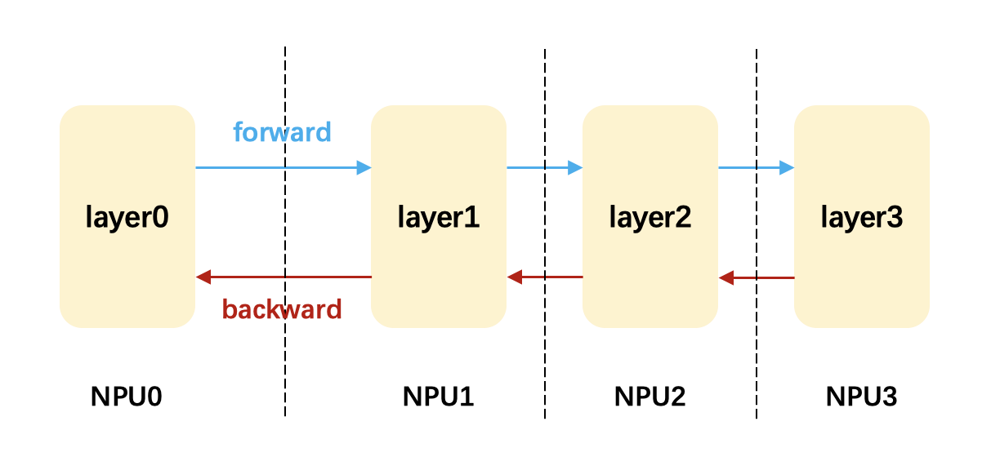
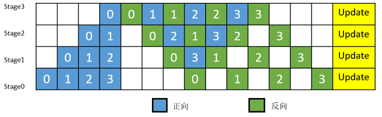
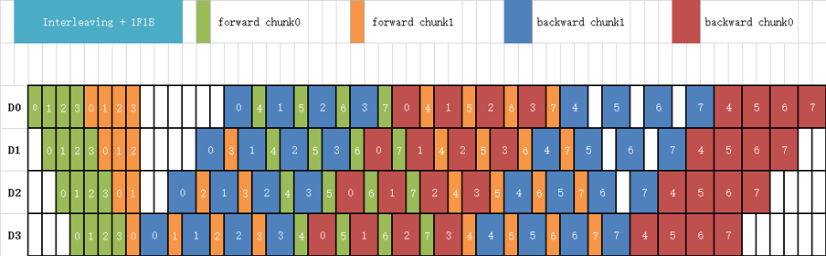

# MindSpore流水线并行实践指南

本教程基于 MindSpore 2.5.0 版本，演示如何使用流水线并行技术加速模型训练。示例代码在 4张 Ascend 910* 卡运行。


## 0. 流水线并行介绍 (introduction)

流水线并行技术将计算任务划分为连续阶段，分布到不同处理单元，数据按微批次流经各阶段以提升吞吐量。其核心通过时间-空间维度并行，突破单设备内存限制，适用于大模型训练（如Transformer）。不同于数据并行（多设备处理不同数据）和模型并行（拆分模型层），流水线并行强调阶段(pipeline stage)间流水调度，但存在“气泡”(Bubble)和通信开销。关键实现包括负载均衡、微批次(micro-batch)划分及同步策略（如GPipe, Interleave等）。尽管实现复杂，结合模型/数据并行后，成为分布式训练超大规模AI系统的核心方案。

**整体示意图：**

<p align="center">
  <br/>
  <em>图1：这里是图片说明</em>
</p>


**实现原理：**

<figure>
  
  <figcaption align="center">图2：mindspore 1f1b 流水线并行调度示意图</figcaption>
</figure>

<figure>
  
  <figcaption style="text-align:center;">图3：mindspore interleaved 流水线并行调度示意图</figcaption>
</figure>

## 1. 流水线并行核心配置 (init and setting)

```python
# 设置运行模式为图模式
context.set_context(mode=context.GRAPH_MODE)

# 配置半自动并行策略
mindspore.set_auto_parallel_context(
    parallel_mode=mindspore.ParallelMode.SEMI_AUTO_PARALLEL,
    pipeline_stages=4,                  # 一共有4个pipeline stage
    pipeline_config={
        'pipeline_scheduler': '1f1b',   # 使用1F1B调度策略
        'pipeline_interleave': True     # 启用流水线交错
    }
)

# 初始化分布式环境
init()
```


## 2. 模型定义与阶段划分 (define)

```python
class Mlp(nn.Cell):
    @mindspore.lazy_inline  # 必须使用lazy_inline装饰器
    def __init__(self, num_layers=4, in_channel=512, out_channel=512):
        super().__init__()
        layers = [nn.Dense(in_channel, out_channel, activation="relu", has_bias=False)]
        for _ in range(num_layers-1):
            layers.append(nn.Dense(out_channel, out_channel, activation="relu", has_bias=False))
        self.layers = nn.CellList(layers)
        self.loss_fn = nn.MSELoss()

    def construct(self, x, labels=None):
        for layer in self.layers:
            x = layer(x)
        return self.loss_fn(x, labels)

# 创建模型 (create model)
net = Mlp()

# 分配流水线阶段 (pipeline stage)
net.layers[0].pipeline_stage = 0  # 第1个Dense层分配到stage0
net.layers[1].pipeline_stage = 1  # 第2个Dense层分配到stage1 
net.layers[2].pipeline_stage = 2  # 第3个Dense层分配到stage2
net.layers[3].pipeline_stage = 3  # 第4个Dense层分配到stage3
net.loss_fn.pipeline_stage = 3    # 损失函数分配到stage3

# 封装为流水线模型
pp_net = nn.PipelineCell(net, micro_size=4)  # micro_batch_size=4
```

> ⚠️ 注意：用于进行流水线并行的模型需要使用 `@mindspore.lazy_inline` 装饰器。


## 3. 训练 (training)

```python
# 初始化优化器和梯度函数
optimizer = nn.SGD(net.trainable_params(), learning_rate=0.001)
grad_fn = ops.value_and_grad(pp_net, None, optimizer.parameters)
pp_grad_reducer = nn.PipelineGradReducer(optimizer.parameters)

@mindspore.jit
def train_step(inputs, target):
    loss, grads = grad_fn(inputs, target)
    grads = pp_grad_reducer(grads)
    optimizer(grads)
    return loss, grads

# 构造示例数据（batch-size必须能被micro-batch-size整除）
x = Tensor(np.random.randn(4, 512), mindspore.float32)
y = Tensor(np.ones((4, 512)), mindspore.float32)

# 训练循环
for i in range(100):
    loss, grads = train_step(x, y)
    if (i+1) % 10 == 0:
        print(f"step: {i+1}, loss: {loss}")

# 打印当前卡所在stage的权重大小和梯度张量大小
print(f"{net.layers[get_rank()].weight.shape=}, {grads[0].shape=}")
```


## 4. 运行示例代码 (running)

```shell
# 运行示例代码，使用前4张卡
ASCEND_RT_VISIBLE_DEVICES=0,1,2,3 msrun --bind_core=True --worker_num=4 --local_worker_num=4 --master_port 9001 --log_dir=outputs/parallel_logs \
python -u code/pipeline-parallelism.py

# 查看日志 (pipeline并行一般查看最后一个节点的日志)
tail -f outputs/parallel_logs/worker_3.log
```

输出打印：
```
step: 10, loss: 3.8794, time cost: 7.13 ms
step: 20, loss: 3.8757, time cost: 7.21 ms
step: 30, loss: 3.8719, time cost: 6.92 ms
...

net.layers[get_rank()].weight.shape=(512, 512), grads[0].shape=(512, 512)
```


## 5. 关键注意事项

1. **设备分配**：需要保证`pipeline_stages`数量能被实际使用的GPU数量整除。
2. **数据规范**：`micro-batch`大小需能被`batch-size`整除。
3. **装饰器要求**：使用`@mindspore.lazy_inline`装饰模型初始化方法


## 6. 常见问题

**Q1: 如何验证流水线并行是否正确工作？**
A: 检查不同stage的NPU卡显存占用情况，各卡应有相似的显存使用量。

**Q2: 如何扩展更多流水线阶段？**
A: 增加pipeline_stages参数值，并相应调整模型层的stage分配。

**Q3: 微批次大小如何选择？**
A: 通常设置为总批次大小的约数，可通过实验选择吞吐量最大的值。

**Q4: 有没有关于流水线并行以及相关接口的更详细说明？**
A: 有，可以在[MindSpore网站](https://www.mindspore.cn/docs/zh-CN/master/model_train/parallel/pipeline_parallel.html)搜索“流水线并行”。
